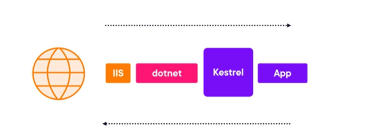
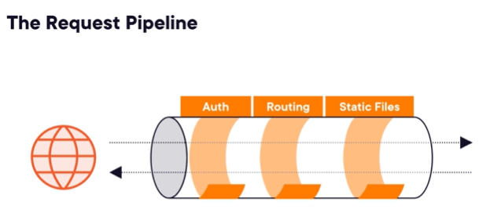
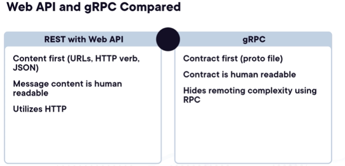

# WebApi Fundamentals

Every asp.net core application starts its life as a command line application (with args).
When the application is started the code in _Program.cs_ is executed.
First a builder is created to configured the app. It is this builder that is used for dependency injection.
When the app is created it is commanded to run.
When we start our application, we can see a console that gives the logs and it listens to an URL, the same as the one in the browser.
This means that our web application has built-in its own web server and browsers can talk to it directly.
This built in webserver is called _Kestrel_, allowing the developers to focus on developing their app, without the need to configure their own web server, at least during development time. They just run the project.
For production environments, kestrel will not be sufficient.
So we can put a webserver in front of our application like _IIS_ on _Windows_ or _NGNIX_ on _Linux_, see the picture bellow:

The IIS uses _dotnet cli tool_ to start the application and keep it running.
Finalyzing the analysis of the _Program.cs_ file:

Usually this file has a lot of methods that act on the app object, that start with the work "Use". These methods configure what is called the request pipeline.
We are basically opting in ASP.Net core features.
Once a request reaches our application through kestrel, it is processed by a number of steps, in order, that make up the aforementioned request pipeline.
This pipeline is called the application middleware. It looks like a variation of the chain of responsibility pattern. Each step of the middlerare can choose to break the chain or pass the request along to the next handler in the pipeline.
The order we configure the pipeline steps matter because the request travels through the middleware in sequence.
Each step can do something with a request, participating in forming the response.
A brief picture on how the pipeline looks like:

We have to plug middleware for routing, that maps a URL used in the browser to a part of our application.
The same goes for authorization. This are all static methods to add steps for the pipeline, provided by asp.net core.
Use static files is also another step for the middleware.
There is also the possibility do add our custom middleware instead.

One of the possibilities of ASp.net core is the development of web APIs.
Web Apis send serialized data over the wire using json (used most of the time).
ASP.net core allows us to develop REST-based APIs that:

1. Http protocol is leverage
1. Each piece of data is available at a unique location.
1. Http methos map into actions:
   1. Get - get data
   1. Post - create data
   1. Put - update data.
   1. Delete - deletes data.
1. HTTP status codes are used to determine outcomes.
1. Responses can also contain pointers on what to do next (example when a resource is created, we can return the url to fetch the new resource).
1. Api can be built using controllers.
1. support for CORS can be added. Request done by applications than run in the browser outside of a certain domain can be totally blocked. With CORS we can allow applications explicitly.

Controller is the heart of the API. It requires attribute based routing.
The controller has a base url, but then has several actions.
Http client is the class in .net that we use to perform http requests.

There is another way of creating rest APIs called minimal APIs. Instead of controllers we add EndpointsApiExplorer.
Minimal APIs basically map endpoints to delegates. These delegates will have dependencies that IoC container resolves for us.
There are some caveats on not having controllers: validation needs to be done by ourselves.

# gRPC APIs

This is another way of deveolping apis. gRPC is a standard different from REST.
Instead of using HTTP requests, gRPC uses remote procedure calls: it means calling a method on a remote location.
gRPC focus heavenly on performance and uses a serializaition format called protocol buffers, instead of JSON.
A contract, proto file, is used to describe what methods the API has and what the parameters and return types are.
The contract is shared by the client and the API.
We only need one endpoint per service not a multitude of them like in rest.

Here it is a comparision of the two:

gRPC is more suitable for APIs used whithin the same organization because all APIs need to know how the API sticks together. It is behavioral coupling and if the contract changes all clients need to be updated.
Rest is more suitable for public APIs.
We can have both though. A webAPI can expose both types of endpoints.

# Signal R

So far we have seen clients calling operatinons on the server. SignalR allows us to have the server notify the clients
and call methods on the clients ( as remote procedure calls as well).
Using the HUB class messaages can be sent to all clients.
SignalR has not contract though. The call is done via a string topic.
It requires a permanent 2-way connection which is not always stable, plus having the downside of secure a permanent connection.
Because of these reasons signalR is mainly used to send non critical messages to apps running on browsers and update their UI.
This was a resume of ASP.Net core can do. Some things in common for all is the middleware and dependency injection.
