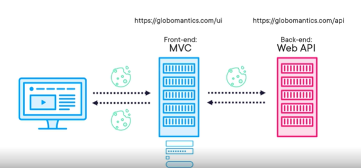
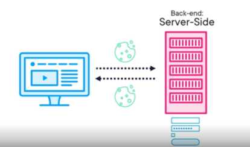
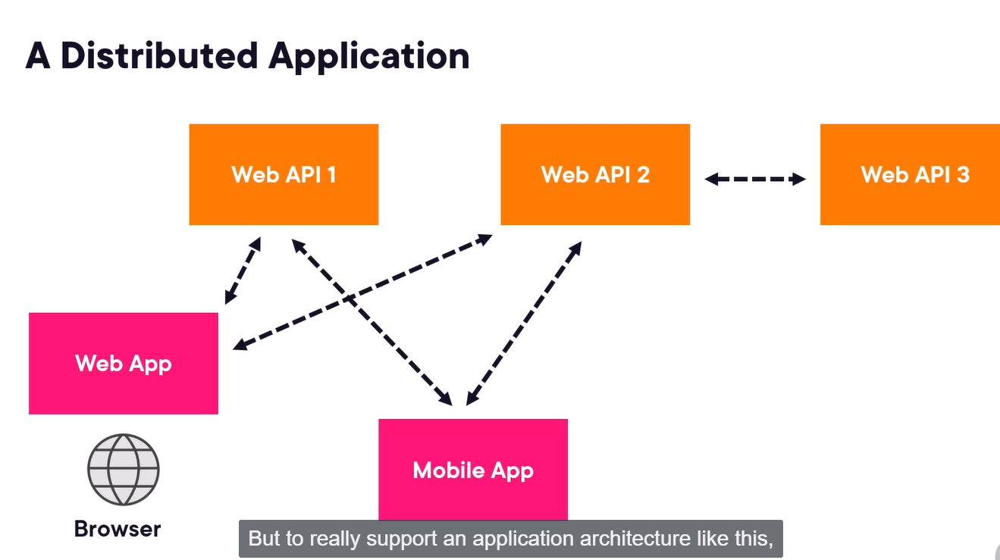
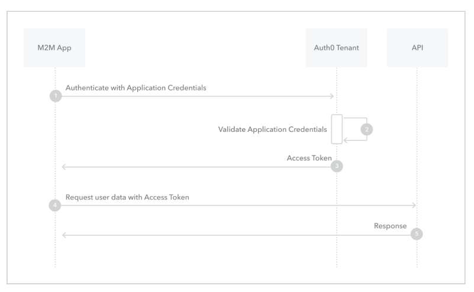
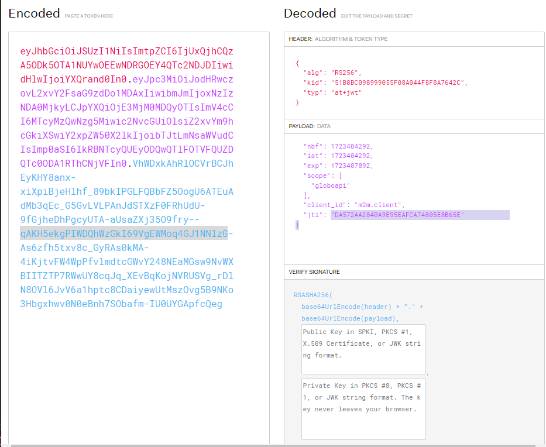
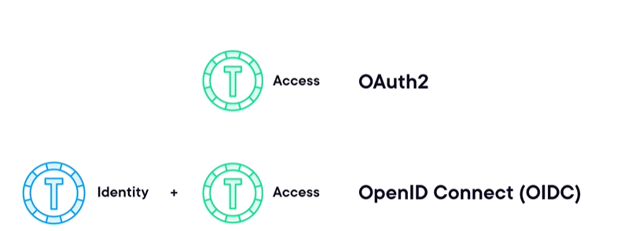
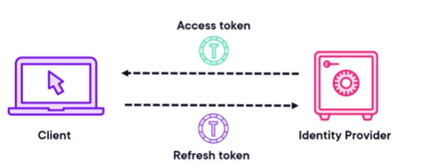
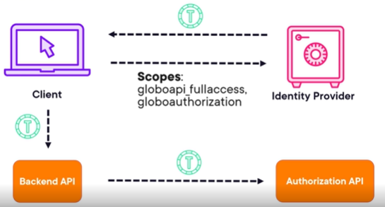

# Authentication and Authorizarion in ASP.NET

APIs manage data and or business logic for applications; therefore they are often the heart of an organization!
As such they need to be protected. This is what this project is about.
This folder of authentication and authorization has several projects, split by folders, each project demonstrate a differente type of authentication.

# Protecting APIs with keys

The most basic way of protecting APIs is by using a key.
A key is like a password that must be supplied by the consumer of an API to gain access.
The consumer is typically another application. An http header is often used to do that. The browser in our api has nothing to do with a key (stored in the API.). It is just used for machine to machine.

This approach has several problems:

1. Keys can easily be stolen (usually laying around excel sheets, etc.)
1. Tend to have no expiration (hard to revoke when the attacker gets it).
1. All parties that have the key would have to rotate at the same time.
1. No middleware that supports API keys.

There are often better, more modern and secure options. It is just mentioned here for infomation and completeness purposes.
Api keys can only offer protection on a basic level.
The Api key comes in the http header.
We can protect the api with middleware or API key attribute.
The key coming in the header must come from our mvc app. The key should be stored as a secret. It is fine for demonstration to just put it in the appSettings. In production, we should use secrete storage.

An Api key middleware would look like this:

```
    public class ApiKeyMiddleware
    {
        private readonly RequestDelegate _next;
        private const string _ApiKeyName = "XApiKey";
        public ApiKeyMiddleware(RequestDelegate next)
        {
            _next = next;
        }
        public async Task InvokeAsync(HttpContext context, IConfiguration config)
        {
            var apiKeyPresentInHeader = context.Request.Headers
                .TryGetValue(_ApiKeyName, out var extractedApiKey);
            var apiKey = config[_ApiKeyName];

            if ((apiKeyPresentInHeader && apiKey == extractedApiKey)
                || context.Request.Path.StartsWithSegments("/swagger"))
            {
                await _next(context);
                return;
            }

            context.Response.StatusCode = 401;
            await context.Response.WriteAsync("Invalid Api Key");
        }
    }
```

The key comes in the http request headers and it is shared with the client app. The client app, in our case the MVC app, we configure the http client to send the key in the headers:

```
builder.Services.AddSingleton(sp =>
{
    var client = new HttpClient { BaseAddress = new Uri("https://localhost:5002") };
    client.DefaultRequestHeaders.Add("XApiKey", "secret");
    return client;
});
```

On the web api side, the middleware needs to be configured in _Program.cs_ and we need to define it before the authorization middleware (the order in program.cs matters):

```
 public static void UseApiKeyAuthentication(this IApplicationBuilder webApplication)
 {
     webApplication.UseMiddleware<ApiKeyMiddleware>();
 }
```

With similar code we can create an API key attribute and we can decorate pretty much anything with it: controller level, lambda functions (in case of minimal apis) or individual controller actions.

```
    [AttributeUsage(AttributeTargets.Class |
        AttributeTargets.Method, AllowMultiple = true, Inherited = true)]
    public class ApiKeyAttribute : Attribute, IAuthorizationFilter
    {
        private const string _ApiKeyName = "XApiKey";
        private readonly IConfiguration _Config;

        public ApiKeyAttribute(IConfiguration config)
        {
            _Config = config;
        }

        public void OnAuthorization(AuthorizationFilterContext context)
        {
            var httpContext = context.HttpContext;
            var apiKeyPresentInHeader = httpContext.Request.Headers
                .TryGetValue(_ApiKeyName, out var extractedApiKey);
            var apiKey = _Config[_ApiKeyName];

            if ((apiKeyPresentInHeader && apiKey == extractedApiKey)
                || httpContext.Request.Path.StartsWithSegments("/swagger"))
            {
                return;
            }

            context.Result = new UnauthorizedResult();
        }
    }
```

The attribute needs to be referenced like this because it uses dependency injection :

```
    [ApiController]
    [Route("conference")]
    [ProducesResponseType(StatusCodes.Status401Unauthorized)]
    [TypeFilter(typeof(ApiKeyAttribute))] // reference to the attribute
    public class ConferenceController : Controller
    {}
```

The API can work with multiple keys, usually one different key for each external party.

# Cookie authentication

If Apis need to know who the user is, keys won't work.
One ways to send data in a safe way to the APIs is by using cookies. To get an identity cookie users first have to present proof of who they are. This is the authentication or AuthN process.
After authentication; we usually have authorization or AuthZ where we limit access to the application based on who they are (roles, etc.)

Once the user authenticates in the login page, the app sends a cookie to the browser. The browser stores the cookie and sends it in subsequent requests.
The cookie can only be sent to the API if both the front-end and back-end are in similar domains.

This would tightly couple the front-end and back end. Other front ends could not access the same API.
This is a problem in MVC because MVC is a server rendered application.
The alternative is to use a monolithical MVC application that handles the data itself (we wont have a web api anymore). Separating it in a api does not bring value.

The best alternative is to use a SPA (single page application), if we are using cookies, rendered in the browser. So then the back-end API becomes responsible for the authentication itself, providing a login page, and handle the authentication, because is directly accessible by the browser.
The backend can host a login page. The backend is more than an API now and it becomes the server side application:


We included an example in Blazor under the folder cookieSPA. Some notes to pay attention while inspecting the solution: the sever application is referencing the client application. The server application servers the login page. In blazor the sections that require authorization are under the Authorization view.

The server application is a webAPI with an account controller that returns the view to the browser.
The way to ensure the API handles authentication properly is to decorate the controllers with the Authorize attribute. The authorize attribute can receive as a parameter the authentication scheme (the way we autheticate, key, cookie, etc), if there is more than one.

There is a way to declare the authorize attribute globaly, via an Authorize filter.
To disable we can use the [AllowAnonimous] as well.
While on swagger, we can navigate to the login page, enter credentialsand then go back to swagger because the cookie will be set in the browser already.
The cookie contains the claims and the rest of the information to create the ClaimsPrincipal object, that is accessible from the controller base API.

# Token authentication and identity

What about other apps like desktop apps? They do not work with cookies.
Antoher authenication scheme, Bearer toker scheme, can be used.
To keep in mind that we can have more than just one authentication scheme.
The claims information is now sent via the token. When the user logs in, the token is issued.
Tokens do not need a browser and they are not restricted to the same domain.
We checked in the web api fundamentals course, we've seen already the bearer token authentication.
In asp.net core 8, it was introduced ASP.COre identity, that comes with EF core out of the box solution to manage users, roles, etc.
Whem we have architectures like this tokens become a nightmare to manage:


Each api needs to check the token, login, etc
This is where OAuth2 and OpenIdConnect come into play.

# OpenId connect and OAuth2

OAuth2 is an industry standard that uses tokens. It is ideal for distributed applications.
OAuth2 is a standard that describes the format of an access token and how to obtain it.
They are not used like the Bearer tokens of the previous section.
The main difference between the ASP.NET core tokens and OAuth2 tokens is that with OAuth2 there is a third party that provides the token, called the _Identity Provider _ aka STS (secure token servers).

The identity provider is a service application, a special kind of API in the application whose job is to hand out token to applications that need them.
There are several token types like access token for APIs and identity tokens for front-ends.

One of the ways to obtain access token is with the _Client Credentials Flow_. This flow is used with Machine to Machine authentication.
Here is the sequence diagram of the client credentials flow:



To obtain an access token, the client needs to send the ClientId and a Secret (application credentials) to the identity provider.
These credentials have nothing to do with users.
Compared to protect the API with api keys, there are several differences:

1. The access token has a limited lifetime (controlled by the Identity providers)
1. Multiple APIS can be protected at the same time.
1. It is protected by encryption.

Let's dig into the solution present in the folder _ClientCreadentialsFlow_

'''
// here we configure the JWT Bearer token as the default authentication scheme
builder.Services.AddAuthentication(JwtBearerDefaults.AuthenticationScheme)
.AddJwtBearer(o =>
{
o.Authority = "https://localhost:5001"; // where the identiy provider is located.
o.TokenValidationParameters.ValidateAudience = false; // in case the verification that the token came from the authority is not enough
o.TokenValidationParameters.ValidTypes = new[] { "at+jwt" }; // we only accept JWTs
});
'''

The previous lines of code tell the API to use JWT tokens. Bearer means that every request bearing the token will be granted access.
The API will only accept tokens that were issued by the defined authority. It is able to do it by verifying cryptographic characteristics present on the token.
In this scenarion we disabled the audience because the check we do of the tokens authority is enough.
The token can contain a claim that contains the name of the API the token is meant for. If the audience check is done, the claim is checked agains the configured name of the API.
This is a microsofot implementation. We disabled it here because this is not part of the Auth2 standard.
Because this is not the OAuth2 default, the audience claim does not come by default.
We can do that with a policy instead.
We need to add security definitions for the Swagger UI:

'''
builder.Services.AddSwaggerGen(o =>
{
o.AddSecurityDefinition("oauth2", new OpenApiSecurityScheme
{
Type = SecuritySchemeType.OAuth2,
Flows = new OpenApiOAuthFlows
{
ClientCredentials = new OpenApiOAuthFlow
{  
 TokenUrl = new Uri("https://localhost:5001/connect/token"), // where tio obtain the token
Scopes = new Dictionary<string, string>
{
{ "globoapi", "Access to Globomantics API" },
}
},

        }
    });
    o.AddSecurityRequirement(new OpenApiSecurityRequirement
    {
        {
            new OpenApiSecurityScheme
            {
                Reference = new OpenApiReference
                {
                    Id = "oauth2", //The name of the previously defined security scheme.
                    Type = ReferenceType.SecurityScheme
                }
            },new List<string>()
        }
    });

});
'''

We created our own identiy provider with a framework called identity server. It is free for dev and testing, but paid for productions. Do not implement your own security solution even if you have to pay for tools like identity server.
There are alternatives to the identity server like the OpenIdDict.
Inspecting the code of identity server, we see identity server does not come with its own users store. It was created based on a template provided by Duende.
It has a helper method to add test users.
What are identity resources and scopes and clients?

```
   isBuilder.AddInMemoryIdentityResources(Config.IdentityResources);
   isBuilder.AddInMemoryApiScopes(Config.ApiScopes);
   isBuilder.AddInMemoryClients(Config.Clients);
```

A scope is a string that represents either a collection of user claims or access to an API.
The collection of claims is called the _Identity scope_
The APi scope represents the physical API we want to protect, which in this case it is just our API: lower case is the convention.
Client is an applications that wants tokens. See the example of a client:

```
new Client[]
{
    // m2m client credentials flow client
    new Client
    {
        ClientId = "m2m.client",
        ClientName = "Client Credentials Client",

        AllowedGrantTypes = GrantTypes.ClientCredentials, // grants are tied to flows. We are granting the client credentials flow to this client.
        ClientSecrets = { new Secret("511536EF-F270-4058-80CA-1C89C192F69A".Sha256()) }, // not a good idea to have this in source control

        AllowedScopes = { "globoapi" },   // the client is only allowed thi API.

    },
}
```

We can configure the access lifetime of a token here as well.
Resuming for now:

1. The client asks the idendity provider for a token.
1. If the client is authenticated, it sends the token in the subsequent requests to the API.
1. The API checks for the token the client is sending and verifies if it is authorized to access the resource.

Let's see how our client app fetchs the token from the identity provider:

```
builder.Services.AddDistributedMemoryCache();

// duende nugget package token management. it manages the life cycle the token
builder.Services.AddClientCredentialsTokenManagement()
    .AddClient("globoapi.client", client =>
    {
        // the token endpoint of duende identity server
        client.TokenEndpoint = "https://localhost:5001/connect/token";

          // because we are using client credentials flow, the client id and
         //secret need to be provided.
        client.ClientId = "m2m.client";
        client.ClientSecret = "511536EF-F270-4058-80CA-1C89C192F69A";


        client.Scope = "globoapi"
        // the client also needs to tell what it wants by specifying one or more scopes.
                                   // This is an API scope. This will result in a token for that API.;
    });

// http client to perform API requests. Note that we mention the previous client that
//fetchs the token. The access token is cached in the asp.netcore distributed memory cache.
builder.Services.AddClientCredentialsHttpClient("globoapi",
    "globoapi.client", client =>
{
    client.BaseAddress = new Uri("https://localhost:5002");
});


```

So on client side we need to know: the location of the identity provider, the client id and secret, the scopes we want to ask, cache the token to not fetch it every time and see if it is still valid (duende nugget is doing that for us).
In the service layer, we just use the *IHttpClientFactory*and fetch the client by name.
Note: check the solution under the folder /ClientCredentialsFlow.

# Inspecting the token

The token contains the following sections:

1. the header.
1. the payload contain the user information, scope and claims.
1. the signature. The signature is the payload encrypted using a private key.
   The API decrypts it using a public key and verifies that the payload content matches with the signature:
   
   So the token is encoded, not encrypted (besides the signature part).
   This is how an API verifies the contents of the token.
   

Asymetric encryption: the use of public/private key pairs for encryption information. Where does the API fetch the public key? The answer lies in the discovery document of Duende, on the jwks link.

Keys are typically rotated. The _kid_ header in the discovery document is the current key being used.

# Reference tokens

JWTs are said to be self contained. All information, including the expiration time, is included in the token itself (no additional request).
There is no way to revoke the token after it is issued abd before it is expired.
Reference tokens solve that. they contain no information they have just an id. The backend will access the introspection endpoint of the identity provider, and it will give back the token with all the information jwt provides, plus if it is still valid (token can be immediatly revoked).
This is more load on the identiy provider (caching defeats the purpose), so it is recommend only where is the urgent neeed to revoke tokens. Check _ReferenceTokens_ folder.

# Using Fron-ends to obtain tokens

So far we have seen the client credentials flow suitable for machine to machine.
When there is a user involved, we need to implement the _Authorization Code Flow_.
It is the identity provider that has the login screen and the user store.
When the user logs in, the identity provider will send tokens to the front-end:

1. Access token, meant for APIs
1. Identity token that contains the claims, personal information.

When using a SPA we always need a component that lives on the server that suports the login. This pattern is called BFF: Back-end for Front-end.

The identity token is described in an addon to the OAuth2 standards. OAuth2 is only about access tokens. When identity tokens are involved, the standar is called OpenID Connect:



The login page is on the Duende csproj. It can be customized.
What we were protecting so far, with the client credentials flow, was the API. The controllers of the MVC app were not protected. But now we can.
On the _Authorization Code Flow_ solution, the API uses JwtBearer tokens:

```
builder.Services.AddAuthentication(JwtBearerDefaults.AuthenticationScheme)
    .AddJwtBearer(o =>
    {
        o.Authority = "https://localhost:5001";
        o.TokenValidationParameters.ValidateAudience = false;
        o.TokenValidationParameters.ValidTypes = new[] { "at+jwt" };
    });
```

On the identity provider side, we added a new type of client, interactive:

```
            // interactive client using code flow + pkce
            new Client
            {
                ClientId = "interactive",
                ClientSecrets = { new Secret("49C1A7E1-0C79-4A89-A3D6-A37998FB86B0".Sha256()) },

                AllowedGrantTypes = GrantTypes.Code, // authorization code flow

                RedirectUris = { "https://localhost:7113/signin-oidc" }, // where the tokens will be delivered
                //signin-oidc is the default value used by the OIDC client middleware.
                // The client will also send this on the request to the identity provider. They need to match
                FrontChannelLogoutUri = "https://localhost:7113/signout-oidc", // what uri is hit when the user logs out of the identity provider
                PostLogoutRedirectUris = { "https://localhost:7113/signout-callback-oidc" },

                AllowOfflineAccess = true,
                AbsoluteRefreshTokenLifetime = 2592000, // 30 days
                SlidingRefreshTokenLifetime = 1209600, // 14 days

                Claims = new ClientClaim[]
                {
                    new ClientClaim("clienttype", "interactive")
                },

                // api and identity tokens. Profile is a collection of user claims. The claims can also be sent with access token
                AllowedScopes = { "openid", "profile", "globoapi_fullaccess" },
            },
```

The Grant type is code, meaning authorization code flow.
On the client side, MVC APP we need to configure the OpenIdConnect.
This allows us to protect the front-end with the backend as well. Let's check the front end code:

```
builder.Services.AddAuthentication(o =>
{
   o.DefaultScheme = CookieAuthenticationDefaults.AuthenticationScheme;
   o.DefaultChallengeScheme = OpenIdConnectDefaults.AuthenticationScheme;
})
   // 2 authentication schemes: cookies and open id connect
   // open id connect authentication is only used once, when the user is not authenticated.
   // for subsequent requests, an identity cookie will be sent to the MVC app to identify the user. That is why the challenging scheme is the openIDConnect and the default scheme is cookie
   .AddCookie(o => o.Events.OnSigningOut =
   // revoke the refresh token when the user signs out
       async e => await e.HttpContext.RevokeRefreshTokenAsync())

   .AddOpenIdConnect(options =>
   {
       options.Authority = "https://localhost:5001";

       options.ClientId = "interactive";
       //Store in application secrets
       options.ClientSecret = "49C1A7E1-0C79-4A89-A3D6-A37998FB86B0";
       options.Scope.Clear();
       options.Scope.Add("openid"); // scopes to request.
       options.Scope.Add("profile");
       options.Scope.Add("globoapi_fullaccess");
       options.Scope.Add("offline_access");

       options.ResponseType = "code"; // authorization code flow
       options.GetClaimsFromUserInfoEndpoint = true;
       options.SaveTokens = true; // MVC app can access the cookie and read ii

       options.Events = new OpenIdConnectEvents
       {
           OnTokenResponseReceived = r =>
           {
               var accessToken = r.TokenEndpointResponse.AccessToken;
               return Task.CompletedTask;
           }
       };

   });
```

To read the access token we can fetch from the http context. The access token will not contain user info and claims as well because we asked for those scopes, unlike in the client credentials flow.
The API will not reject the token immediatly after it expires because there is a grace period built in, in the ClockSkew property with default being 5 minutes:

```
builder.Services.AddAuthentication(JwtBearerDefaults.AuthenticationScheme)
    .AddJwtBearer(o =>
    {
        o.Authority = "https://localhost:5001";
        o.TokenValidationParameters.ValidateAudience = false;
        o.TokenValidationParameters.ValidTypes = new[] { "at+jwt" };
        o.TokenValidationParameters.ClockSkew = 10
    });
```

# Refresh Tokens

With the client credentials flow it is an easy task. Refresh tokens are part of OAuth2 standard, so the users do not enter the credentials again. It only works if the client asks for the scope _offline_access_
The identity provider needs also to be configured to allow such scope.
When the token expires, the client can send the refresh token to a special endpoint on the identiy provider to get a new access token back:



The cycle can go on until the refresh token expires.
The identiy provider needs to be configured as well:

```
                AllowOfflineAccess = true,
                AbsoluteRefreshTokenLifetime = 2592000, // 30 days
                SlidingRefreshTokenLifetime = 1209600, // 14 days
```

We can see the absolute time and sliding time. What does this mean? This mean the access token will bre refreshed after 14 days, then 14 days after but then 2 days. After the 30 days the user needs to login again.
Identity providers have the ability to revoke the refresh token, so if its stolen, we can prevent further damage.
We can include claims at the resource lelvel (will be sent always) and at the scope level. At the scope level, the claims are only included in the token when the specific scope is requested.
We can also add individual client claims.

# Authorization

Authorization does not have to come from access tokens only: it can come from cookies or external API.
Authorization is ultimately done on the client, that receives the token. Once authentication is done, the identity provider is done too.
How does the API checks the token was meant for the API and just not bluntly receives it? We need to check for the audience claim. If the audience is not present, we check the scopes.
On the controller level we have a _User_ of type _ClaimsPrincipal_ that has ClaimsIdentity that correspond to the authentication schemes, that have the claims.
To not check on every request the existence of claims we can create global policies and centralize authorization.
Policies together with the authorization attributes can be used at controllers and controller actions.
This is the program.cs of the API:

```
builder.Services.AddAuthorization(o =>
{
    o.AddPolicy("fullaccess", p =>
        p.RequireClaim(JwtClaimTypes.Scope, "globoapi_full"));
    o.AddPolicy("isadmin", p =>
        p.RequireClaim(JwtClaimTypes.Role, "admin"));
    o.AddPolicy("isemployee", p =>
        p.RequireClaim("employeeno"));

    o.AddPolicy("rolewithfallback", p =>
        p.RequireAssertion(c =>
        {
            var roleClaim = c.User.FindFirst(JwtClaimTypes.Role);
            return (roleClaim == null || roleClaim.Value == "admin");
        })
    );

    //o.DefaultPolicy = new AuthorizationPolicyBuilder()
    //    .RequireClaim(JwtClaimTypes.Role, "contributor")
    //    .RequireAuthenticatedUser()
    //    .Build();
    // we can have default policies and fallback policies.
});
```

Now, at the controoler level:

```

        [HttpGet]
        [ProducesResponseType(StatusCodes.Status200OK)]
        [ProducesResponseType(StatusCodes.Status204NoContent)]
        [Authorize(Policy = "fullaccess")] // only tokens obeying this policy can access this method
        public IActionResult GetAll()
        {
            var conferences = _Repo.GetAll();
            if (conferences == null || !conferences.Any())
            {
                return NoContent();
            }
            return Ok(conferences);
        }
```

We can also specify roles and usernames.
To apply policies globay we can use the Authorize filter:

```
builder.Services.AddControllers(o =>
    o.Filters.Add(new AuthorizeFilter("fullaccess"))); // good place to check if the token was meant for this api if not using audience.
```

# Authorization considerations

It is recommended to use socpes because no matter the flow we use, these will be available. In production scenarios we might have multiple APIs talking to our API (using client credentials) as well as severall different frontends (using authorization code).
The scopes are configured in the identity provider. Identity providers determine which client gets which scopes.
We need to be carefull while setting policies to not let unfiltered data get to clients
If we need complex policies the require dependency injection we can look at requirements and handlers.
We can also add an authorization API if our needs get too big. It would look like this:

this is called poor mans delegation.
The last example in the _AuthorizationService_ folder does that. We created a seperate API for authorization. We need then an Authorization service at our api level, so we need dependency injection for that. We can do that with requirements and handlers:

1. A handler executes the actual policy
1. Requirement is input for the handler.
   It is typical a class with properties the handler uses:

```
    public class IsInRoleRequirement: IAuthorizationRequirement
    {
        public string Role { get; set; }
        public int ApplicationId { get; set; }
    }
```

The handler:

```
    public class IsInRoleHandler: AuthorizationHandler<IsInRoleRequirement>
    {
        private readonly IAuthorizationApiService _AuthorizationApiService;

        public IsInRoleHandler(IAuthorizationApiService authorizationApiService)
        {
            _AuthorizationApiService = authorizationApiService;
        }

        protected override async Task HandleRequirementAsync(AuthorizationHandlerContext context,
            IsInRoleRequirement requirement)
        {
            var userId = context.User.FindFirst(ClaimTypes.NameIdentifier).Value;
            var permissions = await _AuthorizationApiService
                .GetPermissions(int.Parse(userId), requirement.ApplicationId);

            if (permissions.Role == requirement.Role)
                context.Succeed(requirement);
        }
    }
```

Now defining the policy in _Program.cs_:

```
builder.Services.AddAuthorization(o =>
{
    o.AddPolicy("isAdmin", p =>
        p.AddRequirements(new IsInRoleRequirement { Role = "admin", ApplicationId = 1 }));
});

builder.Services.AddScoped<IAuthorizationHandler, IsInRoleHandler>();
```

Extension grants can be used to simplify the architecture. Out of the scope of this course.
