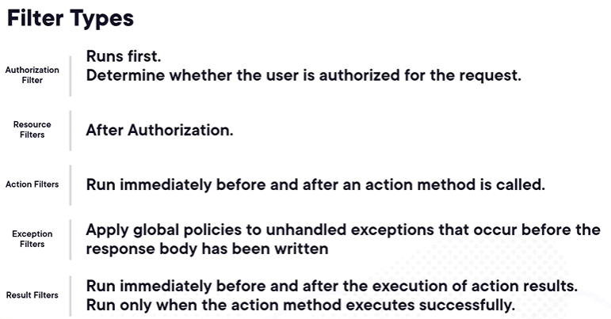

# Error handling in Asp.Core WebApi
In the WebAPI fundamentals we saw how to show problem details and how to add the exception handler middleware for non development environments.
By default, ASP.NETCore has a developer exception page that is shown during development.
We need to be careful with this. Showing exceptions during development is ok. In production it is not.
In production we would be exposing internal implementation details, increase attack vulnerabilities.
We can control how errors are displayed both in development and in production.
We can add problem details and we can create a custom error page as well.

For that we need to create another controller, the *ErrorHandlerController*
The problem method creates an object result that contains problem details on it. It will try to get the exception details.

This controller has an attribute *AllowAnonymous* so we show erros for authenticated and not authenticated users.

We need to tell in *program.cs* where the route of the exception handler is.
We alsso disabled swagger for this error handler controller, by using *ApiExplorerSettings(IgnoreApi = true)*.

# Filters

Filters run in the request pipeline. See the filter types:

Exception filters apply global policies for unhandled exceptions, which might occur before the response body is written.
Result filters run immediately before and after execution of action results.
We can ceeate exceptions filters so it does not go through the error handler controller.
In our case, we added a *ExternalDependencyExceptionFilter* where we are simulating an error code that would come from the google API for example.
We change the response only when this exception happens. So we are filtering for a custom exception.
This is another way of configuring error responses.

# Map Error codes to instruction links
When we get an error, there will be a link that will take us somewhere to explain that error code.
In our case, for development, we costumized our Problem details to not show this information.
If we want to costumize this type we can by configuring the API behavior options in program.cs:

This is basically mapping each error code to a different page.
If we costumize, we probably should use our own website in production.

# Costumize default error details
When we call the controller base method *Problem* we can see it returns and object result by calling a problem details factory method.
We can provide our own problem details factory.
When we provide our custom implementation, we overried 2 mehtods: one for validation (like the case the api has a mandatory parameter and it is not provided) and the other one for errors.
The last section we configured the mapping between error codes and and the links by  cofniguring APIBehaviorOptions.
When we confiure those options, we can inject the *IOptions<ApiBehaviorOptions>* interface to fetch problem details and the mappings we specified in order to build our problems details factory.
Normally we wouldn't need our own problem details factory. But it is good to know.

# Gloabl exception handling
Asp.net core has b uilt-in exception handler where we can configure what to do when we have unhandled exceptions.
In the filter section we created an exception filter. We can take a step further. Check the common library. We unified exceptions under an interface and we can access exception information to build the error response.
As an example we created a custom request middleware so we do not use the built-in of the asp.net core.