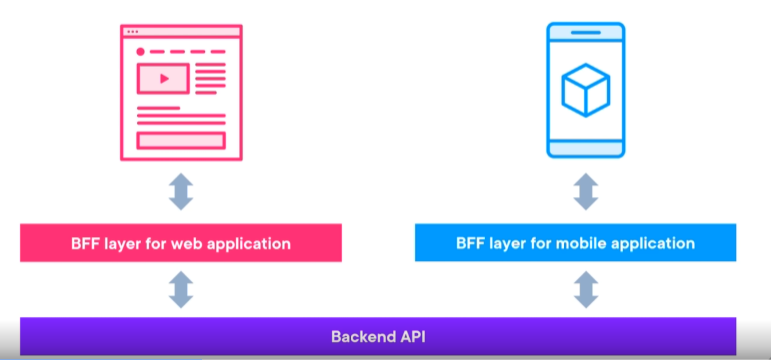
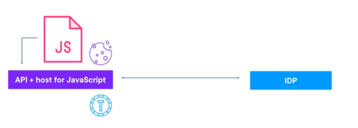
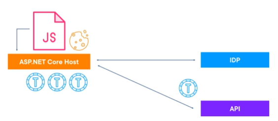

# Securing javascript clients

From a security point of view, javascript and client code is a challenge because the code does not live on the server, like an asp.net core app.
A server we can control and trust, but clients are way harder. An example:
An mvc application in asp.net core, even after the user logs in, we can control access at the level of controller actions. On javasctipt all the code is already on the client and it cannot be blocked. Initially this was not a problem, because javascript was used for small taks. An app would serve a page, after authorization, that had a small portion of javasctipt on it.
Today, javascript is used to build entire applications. The apps require tokens to talk to apis. There are several issues with javascript apps:

1. Cannot safely store secrets. Javascript code with secrets can be viewed by anyone with access to the machine. So client authentication flows do not make sense.
1. Token storage is precarious.We cannot store them in memory, browser, etc. Javascript is vulnerable to XSS (cross site scripting) attacks so an attacker could read our not http cookies or session storage and obtain the tokens.
1. Refresh token storage is even more dangerous. With it, you can get new tokens.

Browsers are restricting cookie usage which disables common OAuth2, Opendidconnect approaches.

The solution for all of this is to have the server handling the security. It is the backend for frontend pattern.

## Backend-for-Frontend pattern

The backend-for-Frontend (BFF) is a layer that sits between a client and a backend. It is a typical pattern for situations like a client from a web browser and a mobile client that request data from the same api. A BFF layer would transform the data to fit each specific ui better:

A BFF can be used to handle security and session management for a frontend.
One approach is to host the javascript application in the same project that contains the API (local api approach).
The flow is started from the server and there is no code in the javascript client for the flow.
An identity token is requested and that results in a cookie. The cookie protects the project. The browser makes sure the cookie is sent on every call to the api. No access tokens required, security is handled by the cookie itself.


Another approach is the api being a separate application, potentially deployed on another domain.
Witht his approach we separate the javascript application on a separate host, like an MVC asp.net core host. The flow is triggered from the server, and the cookie protects the host and none of the tokens are never sent to the client.
This means that the client can never call the remote api directly and calls are proxied via the host:

Factors to take into account when choosing an approach:

1. Ease of development
2. Maintainability
3. Reuse
4. Scalability

We are going to create a remote api approach in this demo. We are going to use Duende bff. It uses YARP (yet another reverse proxy) to proxy behind the scenes our calls from the javascript client to the api.
We coul use it directly. There are of course many rever proxies out there.

## Demo
A sample was included in this section. It has all the code developed so far (until the end of module 9), besides the web client. We add a new project, BFF to show the pattern. 
It acts as the host for our javascript application. It is where our javascript code will live.
We want to authenticate from the BFF not from the javascript client.
The steps to authenticate from a BFF:
1. Add a new client definition:
```
                new Client()
                {
                    ClientName = "Image Gallery BFF",
                    ClientId = "imagegallerybff",                    
                    AccessTokenType = AccessTokenType.Reference,
                    AllowedGrantTypes = GrantTypes.Code,
                    AllowOfflineAccess = true,                    
                    UpdateAccessTokenClaimsOnRefresh = true,
                    RedirectUris =
                    {
                        "https://localhost:7119/signin-oidc"
                    },
                    PostLogoutRedirectUris =
                    {
                        "https://localhost:7119/signout-callback-oidc"
                    },
                    AllowedScopes =
                    {
                        IdentityServerConstants.StandardScopes.OpenId,
                        IdentityServerConstants.StandardScopes.Profile,
                        "roles", 
                        "imagegalleryapi.read",
                        "imagegalleryapi.write",
                        "country"
                    },
                    ClientSecrets =
                    {
                        new Secret("anothersecret".Sha256())
                    },
                    RequireConsent = true
                }
```
2. Because a BFF is a server web app, the configuration is identical to the one of our MVC client. (PCKE protection, same claims etc.)
What differs, it is the secret, client id and redirect URIs.
3. Configure the client:
```
builder.Services.AddHttpClient("IDPClient", client =>
{
    client.BaseAddress = new Uri("https://localhost:5001/");
});

JsonWebTokenHandler.DefaultInboundClaimTypeMap.Clear();

const string bffCookieScheme = "BFFCookieScheme";
const string bffChallengeScheme = "BFFChallengeScheme";

builder.Services.AddAuthentication(options =>
{
    options.DefaultScheme = bffCookieScheme;
    options.DefaultChallengeScheme = bffChallengeScheme;
}).AddCookie(bffCookieScheme)
.AddOpenIdConnect(bffChallengeScheme, options =>
{
    options.SignInScheme = bffCookieScheme;
    options.Authority = "https://localhost:5001/";
    options.ClientId = "imagegallerybff";
    options.ClientSecret = "anothersecret";
    options.ResponseType = "code"; 
    options.SaveTokens = true;
    options.GetClaimsFromUserInfoEndpoint = true; 
    options.Scope.Add("roles"); 
    options.Scope.Add("imagegalleryapi.read");
    options.Scope.Add("imagegalleryapi.write");
    options.Scope.Add("country");
    options.Scope.Add("offline_access");
    options.ClaimActions.MapJsonKey("role", "role");
    options.ClaimActions.MapUniqueJsonKey("country", "country");
    options.TokenValidationParameters = new()
    {
        NameClaimType = "given_name",
        RoleClaimType = "role",
    };
});

```
A key thing here is that the cokkie scheme and and challenge scheme changed. It is a good practice to keep them unique, so cookies in for different applications in the same domain do not interfere with each other.

How to access the identity claims? On our javascript code we do not have access to the cookie. the cookie is encrypted and used by the server. So in order to obtain user information we ask our BFF for it. Check user session controller.