# OAuth2 and OpendIdConnect

## A brief history

In the past, most applications were easy to secure. They were mainly desktop applications and we could use windows authentication. Even for web applications running on intranet.
They were easy to secure because they were not service based.
Mostly, they would run under the same domain, so an authentication cookie could be shared.
Even when wcf was implemented, server to server communication was using SAML 2.0 for the exchange of authorization and authentication data.
It is still widely used in enterprise environments. It is not a very good fit for modern application architectures.

The world is now different. Apps are usually not under the same domain, apis communicate with each other, with many integrations with other systems, etc.
Not that long ago, on every request, username and password were being sent: bad idea. Now we send tokens in every request.

First, people developed home-grown token services. A login endpoint that would take username and password and generate the token. It is a better approach, but it still sends credentials.
Why reivent the weel? we then would need to implement token validation and signing, separate authentication and authorization, for each application, etc.. A lot of mistakes and maintnance issues can happen.

So we look for an identity provider central to all applications. It is the reponsibility of the identity provider to verify the users are who they say they are, and to provide proof of identity to other applications.
This responsibility shouldn't be on the clients.
The identity provider is a central place for IAM (Identity and Access Management):
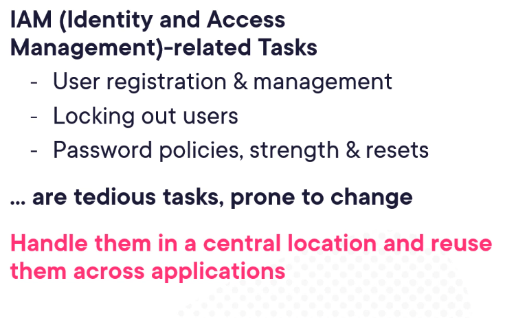

It would be impossible to manage modern enterprise applications without a central identity provider. Changing encryptions algorithms for passwords, etc: we change in one place.
Some apps might require multi-factor authentication and some not, etc. It is very convenient to have a central location for authentication.

## OAuth2 and OpendIdConnect

When big problems like this emerge, standards are born: OAuth2 and OpendIdConnect.
OAuth2 is an open protocol to allow secure authorization in a simple and standardized way for web, mobile and desktop applications.
Oauth2 is all about authorization (we can request an access token to gain access to an API).
OAuth2 defines how a client application can securely achieve authorization:
we need this because all apps are not hosted equal (client mvc app runs totally on server side, while and angular app runs on the client and thus it cannot be trusted).
So the OAuth2 standard defines how to use the standard endpoints: token expriration, etc.
Oauth2 defines how to obtain tokens to access the API, not how to sign on a user or a client app. For that we have OpendIdConnect.

OpendIdConnect is a simple identiy layer on top of the OAuth2 protocol.
A client application can request an identity token (next to an access token).
The identity token can be used to sign into a client application, while that same application uses the access token to access the API.
OpendIdConnect is the superior protocol: it supersedes and extends OAuth2. Once we deal with users, we use OpendIdConnect.

## Authentication with OpendIdConnect

With Openid connect we are focusing on the identiy, which means we are focused on identiy tokens and not access tokens.
The client application asks the identity provider for proof of identity, so it can use it and rely on it.
Usually, a client app redirects the user to the identiy provider application, where the user needs to prove identity (like username and password, for example).
The identity provider generates an identity token, signs it and sends it to the client application.
The client verifies it and derives claims from it, like an authentication cookie, for example in asp.net core app.
In a mvc app, the browser then sends that cookie on each request.
OpendIdConnect has several types of flows. It may depend on the app (web server app, client app etc).

For that there are public clients and confidential clients:
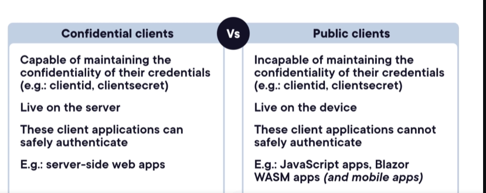

A flow is a set of HTTP requests and responses that determine how an authorization code and/or token are safely delivered to clients.
When we log in into an app, we are often redirected to other identity providers (google, microsoft, etc). There are more than these just visible redirects that happen behind the sceness.

Different client types or requirements can lead to different flows. Flows use endpoints (at the level of the Idp and at the level of the client).

1. The first endpoint, at the IDP level, is the Authorization endpoint. It is used by the client application to obtain authentication and or authorization via redirection.
   OpendIdConnect requires TLS! Tokens are not encrypted.
2. The second enpoint is the redirection endpoint or callback endpoint at client level (this client is redirected to the authorization endpoint, at the level of IDP, and then the IDP redirects back to the client).
   It is used by the IDP to return the authorization code and tokens.
3. Token endpoint (IDP level). Client applications can programatically request token via http post without redirection. It can autheticate confidential clients and not public clients.

Three main flows:

1. Authorization code flow: it is considered (or its variations) the best practice flow at the moment.
2. Implicit: deprecated
3. hybrid: deprecated

For both confidential and public clients, Authorization code flow plus PKCE should be used together. PKCE stands for Proof Key of Code Exchange.
Actually, PKCE is recommended for confidential clients and mandatory for public clients.

The authorization code flow derives its name from the fact that it returns an authorization code from the authorization endpoint.
The authorization code is a short-lived single use credential, used to verify that the user who logged in, at the level of the IDP, is the same one that started the flow of the client application.
Tokens are returned from the token endpoint.
Because public clients cannot safely store their credentials, long lived access is restricted.
Consensus is moving away from handling security at the client in favor of the server (like for example the use of backend-for front end patterns).
Choosing the wrong flow may open security holes. Or wrong decisions on a flow (how to deliver tokens, where to include the claims, etc).

What is a good idea, changes over time. Security changes fast and we should keep up with it. And, a lot of approaches can work and most are not a good idea.

## Setting up identiy server

Creating an identity provider is an important part of creating an application. It is also something teams should avoid doing it from scratch. In this link, https://openid.net/specs/openid-connect-core-1_0.html, we can see the specification of OpendIdConnect.
It is very complex and it is recommended to use existing solutions like, KeyCloak, Duende Identity server, etc.
In our example, we will use identity server: it is part of the .NET foundation and certified by the OpenId fondation. The code is public and it is free for development and testing.
For production, it depends on companies revenue.
Duende has a set of templates we can sart with, by installing them with CLI.

'''
dotnet new install Duende.IdentityServer.Templates
'''
It comes with the following templates:
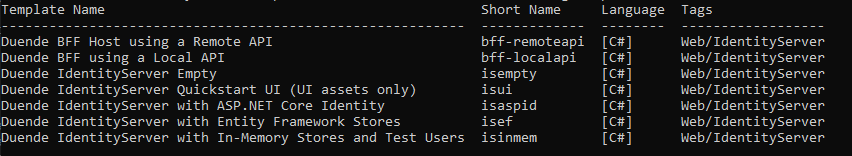

We have templates that come with EF core out of the box, an empty identity server, or an integration with ASP.NET Core Identity.
We are creating a new empty template to learn better how identity providers work, by executing the command:

dotnet new isempty -n Marvin.IDP

Marvin is the name of the company. We use this name instead of image gallery, because identity providers are central to applications, like seen previously.
The empty template comes with serilog for logging and handles a few things for us, like the injection of services and the configuration of the request pipeline:

'''

        builder.Services.AddIdentityServer(options =>
            {
                // https://docs.duendesoftware.com/identityserver/v6/fundamentals/resources/api_scopes#authorization-based-on-scopes
                options.EmitStaticAudienceClaim = true; // this means that audience clain is going to be included in tokens by default.
            })
            // identity related resources
            .AddInMemoryIdentityResources(Config.IdentityResources) // this resources map claim of user like first name, last name, etc
            .AddInMemoryApiScopes(Config.ApiScopes) //by requesting an API scope, a client can get access to an api.
            .AddInMemoryClients(Config.Clients); // for each application a client needs to be defined.

'''

This is coming from a config. Not being persited anywhere. It is ok to get started but of course not ok for production.
When we start the project we do not see much (no user interface yet). But we launch with a self host profile (see launch settings).
We can verify the config in the conventional well-known endpoint: https://localhost:5001/.well-known/openid-configuration
This endpoint lists supported scopes and related claims and more information. This is the endpoint, and its config, that is read by other pieces of middleware to check where the enpoints can be fosund.
Tokens need to be signed and for that keys are needed. Identity server generates that on the fly. When going into production we want to replace that by something more persistent like a certificate.

## Add ui and users

Navigating to our identity provider project, we can call the dotnet new isui to add the ui template from duende. It adds razor pages into the project.
We need to add related services to the IoC container but after this step, when we launch the application, we see the following ui:
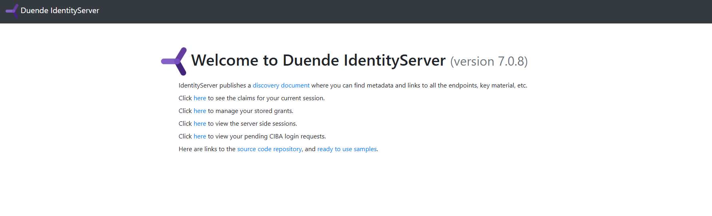

When we added the ui samples, a list of test users was automatically created for us.
A test user has a subject ID, that should be unique at the Identity provider level.
A test user also comes with a few claims.
Claims are information about the user: name, family names, etc.
Claims are related to scopes.
Like we have seen, we are using the open id scope. So anytime a client requests the open id scope the user identifier claim is returned.
In order to return to a client claims like the name, they need to request the Profile scope. We need to add it to the identiy resource list:

'''
public static IEnumerable<IdentityResource> IdentityResources =>
new IdentityResource[]
{
new IdentityResources.OpenId(),
new IdentityResources.Profile()
};
'''
So OpendIdConnect has a few standardized claims. So far we mentioned openid and profile:
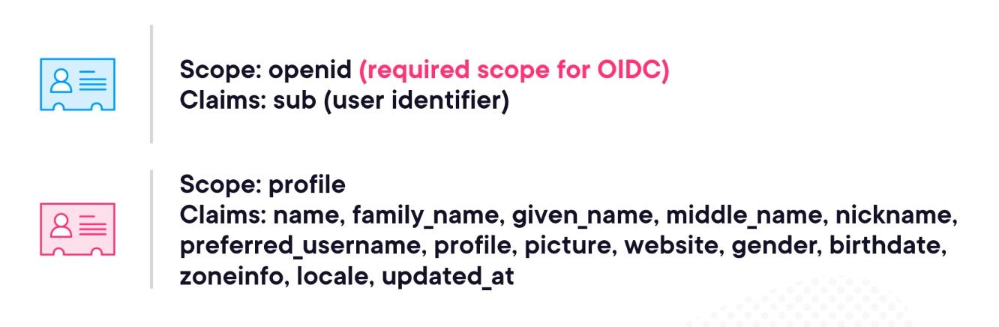

There are more standard scope/claims mapping. Scope phone maps to phone_number, phone_number_verified, etc. We can add our scopes as well.

## Authorization code flow

Autorhization code flow is the advised flow, with PKCE protection. First lets implement without PKCE.
All flows start with a request to the authorization endpoint. This is a simple redirection to a URI at the level of the identiy provider.
Lets see an example of such request uri:
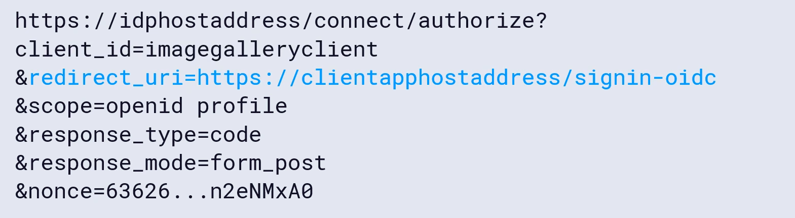

The redirect uri is the URI of the client application where the response of the request is going to be delivered to.
We also see the scopes. We ask for the profile scope.
Response type on that request determines the flow that is used:
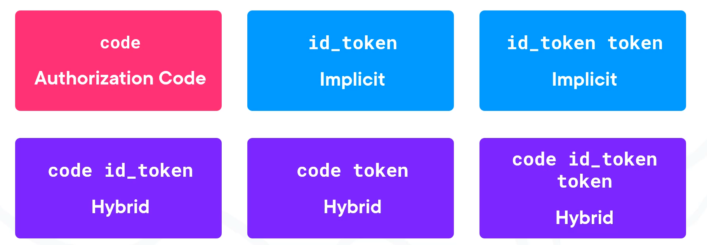

A response type of code means that we are going to use authorization code flow and at the same time that authorization is returned to the type via browser redirection.

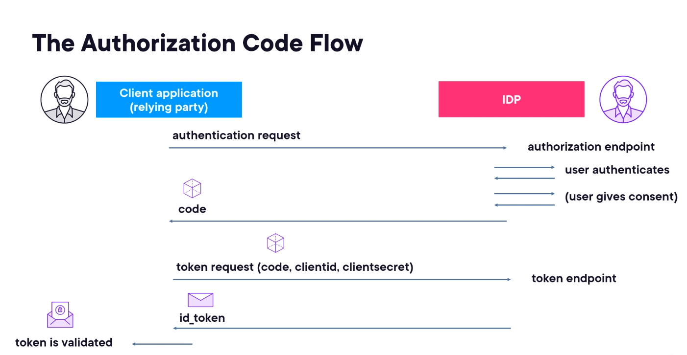

1. First, the client sends a request to the Authorization endpoint, with response type code and other parameters like scopes.
2. At the IDP, the user autheticaticates with user name and password, for example: the idp can ask the user for consent. At this point the client app does not know who the user is, but the idp does.
3. The IDP sends us back to the client application via redirection or via a form post. It sends the authorization code, the response we asked for.
   This code is delivered via the URI, that is called front channel communication (visible to the browser).
4. The client then asks the token endpoint through the back channel (does not use redirection and thus is not visible to the browser). This is a server to server http request (might not apply to static apps living in the browser TO CHECK because this is MVCC APP).
5. The client sends to the token endpoint the authorization code, and other information like client id and secret.
6. At the client, the token is validated. After the token is validated, the client application knows who the user is. There are libraries that do the validation for us.
   On our case, the distinction between fron-channel and back-channel communication:
   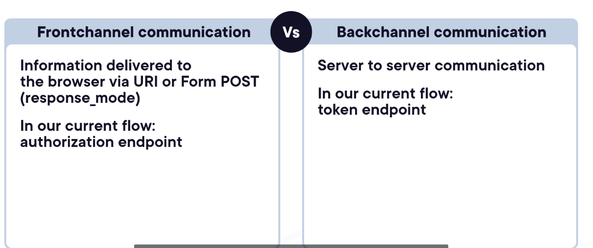

### Loging in with Authorization code flow

1. The first step is to configure a client that will represent our application at the IDP level:

```
 new Client[]
     { new Client { ClientName = "Image Gallery" ,
         ClientId = "imagegalleryclient", // client app identifier
         AllowedGrantTypes = GrantTypes.Code, // authorization code flow
         RedirectUris = { "https://localhost:7184/signin-oidc" }, // client redirect uri  - signin oidc is the default but it can be configured
         AllowedScopes =
         {
             IdentityServerConstants.StandardScopes.OpenId,
             IdentityServerConstants.StandardScopes.Profile
         },
         ClientSecrets = { new Secret("secret".Sha256()) }
     } };
```

2. On our client application because it is a mvc app, first download Microsoft.AspNetCore.Authentication.OpenIdConnect
3. Configure the client request pipeline:

```
builder.Services.AddAuthentication(options =>
{
    options.DefaultScheme = CookieAuthenticationDefaults.AuthenticationScheme;
    options.DefaultChallengeScheme = OpenIdConnectDefaults.AuthenticationScheme;
}).AddCookie(CookieAuthenticationDefaults.AuthenticationScheme)
  .AddOpenIdConnect(OpenIdConnectDefaults.AuthenticationScheme, options =>
{
    options.SignInScheme = CookieAuthenticationDefaults.AuthenticationScheme;
    options.Authority = "https://localhost:5001/"; // authorization server
    options.ClientId = "imagegalleryclient"; // should match client id at the identity provider.
    options.ClientSecret = "secret";
    options.ResponseType = "code"; // authorization code flow
    // these scopes are automatically requested by the middleware
    //options.Scope.Add("openid");
    //options.Scope.Add("profile");
    //options.CallbackPath = new PathString("signin-oidc");
    // this callback path is the same as the redirect URI that we defined at the IDP level. It is commented because this is the default. here for demo purposes.
    options.SaveTokens = true; // configure middleware to save tokens it receives from idp so we can use them.
});
```

We configured cookie as a default authentication scheme. This means that once we have an identity token, that is validated and transformed into identity claims, it will be stored in an encrypted cookie that will be analyzed by our web app. It is where we store the credentials. Notice that the authentication default scheme matches the scheme of the cookie.
In subsequent requests, the cookie will be sent and it is this cookie our app is going to check to validate authenticated requests.
Note: an authentication scheme is a string identifier that represents a specific authentication handler in asp.net core. You can configure multiple authentication methods (e.g., cookies, JWT, or OAuth). Each method is registered with a unique scheme name. Policy enforcement: In ASP.NET Core Authorization, you can tie a specific scheme to an authorization policy.

We can see that we added openid connect scheme as well. This handler will be responsible to perform the authentication requests to the IDP. See that the scheme matches the challenge scheme. See as well that the signin scheme matches the cookie scheme defined previously. This will make sure that the claims will be stored in the cookie with the authentication scheme with the same name.
Then we make sure the request pipelie is requiring authentication:

```
app.UseAuthentication(); // order in the request pipeline matters.
app.UseAuthorization();
```

Now we need to ensure we cannot access a part of our application without an authenticated user. We can do that by decorate the controller with the authorize attribute.

After aplying all this code, once we start the apps, we will notice we will be automatically redirected to the identity provider. That is because of the authorize attribute and because we haven't logged in yet, we will immediatly be redirected, by the middleware, to the authorization endpoint of the identity provider.
By inspecting the browser we will see the authorization request being performed. But we will not see all the requests we mentioned before: because of the back channel communication, the token request is invisible to the browser.
When we inspect the logs of the identity provider we can verify a few more things going on:

1. Request to the token endpoint so the client secret was verified.
2. See the tokens being sent back to the client.

So what happened was that the middleware received an authorization code and it used that to call the token together with the secret and client id. It received an identity token and validated it, stored it and created identity claims from it and stored in an encrypted cookie.
We can verify by looking into the console of our mvc client app.
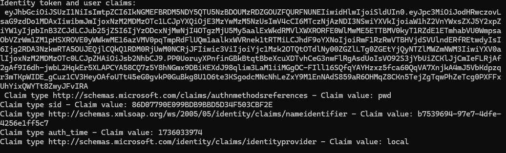

We can inspect the contents of a token on jwt.io.
One good thing to mention here is that we can ask for user consent:
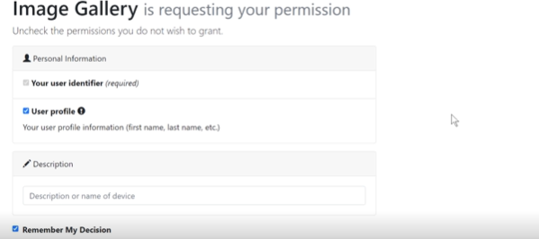
We stat that setting on the IDP, while configuring the client:

```
RequireConsent = true,
```

### Authorization code flow injection attack

Authorization code flow is vulnerable to code injection attacks. This means that an attacker got a hold of the authorization code of the victim and the code is a short term proof of identity that links the server session to the browser session. So the attacker can impersonate a user.
The way to mitigate this is to use the PKCE.
This means that on every request to the authorization endpoint, a secret is created by the client. When calling the token endpoint, the secret is verified. This mitigates the attack because the atatcker does not access the secret generated by the client on every request.

The steps of the authorization code flow with PKCE are similar to the standard authorization code flow, with a few key differences.
Before calling the authorization endpoint, the client application creates a code_verifier and hashes it. It sends this hashed version (the code_challenge) to the authorization endpoint. The idp stores the code. The next steps are similar besides the fact that the token request will include the original code, that is going to be hashed by the identity provider and see if they match.
Summary:

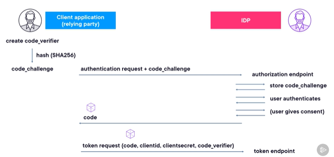

## Logout

To logout the users the proper way we need to implment the following:

1. Add the loggout button in the user interface to call the action of the controller above. (Layout cshtml)

```
        @if (User.Identity.IsAuthenticated)
        {
            <li>
                <a class="nav-link text-dark" asp-area="" asp-controller="Authentication" asp-action="Logout">Logout</a>
            </li>
        }
```

2. Add an authentication controller to our mvc app.

```
    public class AuthenticationController : Controller
    {
        [Authorize]
        public async Task Logout()
        {
            // to logout the application must clear the cookie.
            // the scheme name must match the name we used to configure the authentication middleware.
            await HttpContext.SignOutAsync(CookieAuthenticationDefaults.AuthenticationScheme);

            // redirects to the IDP linked to the scheme
            // OpenIdConnectDefaults.AuthenticationScheme so it clears the session
            await HttpContext.SignOutAsync(OpenIdConnectDefaults.AuthenticationScheme);
        }

    }
```

3. The above actions logs out the user from our MVC app but without the lines that sign out of the open id authentication scheme, the user would not be logged out from the identity provider and as such the login screen would not be shown again.

4. Implement the redirect after signing out. To not get stuck at the logout page of the IDP, we need to configure it and register the post logout redirects:

```
// config of the client at the idp level
PostLogoutRedirectUris = { "https://localhost:7184/signout-callback-oidc" },

```

On the mvc app side signout-callback-oidc is the default value used by opend id connect so nothing there needed.

See the logging of the idp of a session end. We see the redirect and a token hint. The token hint helps to do confirm the user that originated the request and prevent redirect attacks.


```
    public static readonly bool AutomaticRedirectAfterSignOut = true; // this redirects automatically after logout.
```

## User info endpoint

By default, identity server does not include identiy claims safe for the user identifier in the identity token (we do not want to configure like that):

1. In some flows the identity token might be returned from the authorization endpoint directly (the token becomes bigger).
2. Decreases the potential of attack.

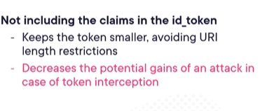

So how do we obtain the user information?
There is a user info endpoint we can use to request additional claims. It requires an access token with scopes related to the claims that must be returned: if we want the profile information, the access token must contain the profile scope.
The access tokens and refresh tokens can be returned from the token endpoint as well. In our flow an access token is delivered together with an identity token.
So the flow revised (omitting the first part of the authorization code):
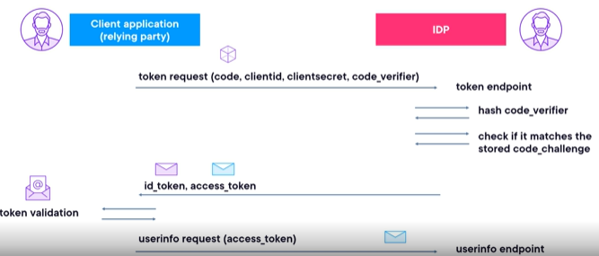
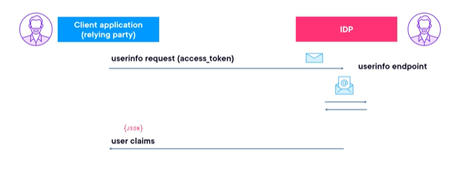
To get the middleware of out MVc app to call the user infor endpoint is a matter of setting this when we add the openid connect to the IoC :

```
    options.GetClaimsFromUserInfoEndpoint = true;
```

If we inspect the token, we do not see the claims but if we see the output of our mvc app and the idp, we can verify that there were requests to the user info endpoint and we can verify the information:
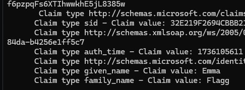

Let's inspect the identity token and see what its fields mean.
The format of an identity token is JWT:
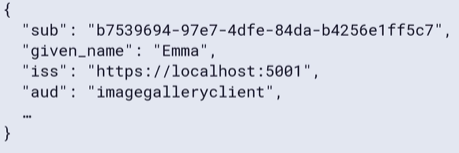

1. The sub is the user identifier or "subject". it is always returned when used openidconnect.
2. Iss means the issuer of the idenity token: URI of the identity provider.
3. aud stands for audience, the audience for this token. In our case the client application.
4. The next four items represent the seconds passed since January first 1970. Iat issued at. exp: expiration of the token.
5. amr: authentication methods used.
   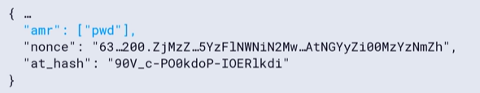
   This can have other values like a one time password or a multi-factor authentication.
6. nonce: number only used once. Generated at client level and it is sent back ffrom the IDP. It can be checked during token validation and helps prevent cross-site request forgery attacks.
7. at_hash is a number used to link an access token to this specific identity token

Depending on the idp used, extra claims can come with the identity token.

## Working with claims

The identity claims allows us to show specific information in the web app. They are also important for authorization.
To make sure the claim types stay the same as they come from the identity provider, we can add this in the program.cs:

```
JsonWebTokenHandler.DefaultInboundClaimTypeMap.Clear();
```

The middleware of openidconnect filters out some claims before creating the claims identity and storing them in a cookie. Most likely, claims that are not that useful. We are allowed to get the claims we want and get rid of the ones that are not necessary (keep the cookie smaller as it can be). See the example of how to configure the middleware to not filter out the audience claim, and to remove a claim from the claims identity:

```
// done in addOpenIdConnect method
options.ClaimActions.Remove("aud"); // remove a filter
  options.ClaimActions.DeleteClaim("idp");
```

## Rbac

So far we have seen authentication: the process to determine who a user is. Lets dive into authorization: the process of determining what a user is allowed to do.
One way to do that is use Role-Base access control. A role has a set of permissions that tell us what a user is/is not allowed to do.
There is also another way like attribute based access control (preferred over rbac and to see later).
To enable RBAC we need:

1. define new claim "role" and add to test users
2. Add a new identity resource. Role scope is not standard of OpendIdConnect. So when a client asks for this scope, the defined claims for this scope need to be returned.

```
    new IdentityResource("roles", "Your role(s)", new [] { "roles" }),
```

3. Add roles to the allowed scope list of the client application:

```
  AllowedScopes =
  {
      IdentityServerConstants.StandardScopes.OpenId,
      IdentityServerConstants.StandardScopes.Profile,
      "roles",
  },
```

4. On the client app ask for this additional scope and apply the mapping from the claim to the claims identity:

```
options.Scope.Add("roles");
    options.ClaimActions.MapJsonKey("role", "role");
```

5. Configure the token validation parameters. When we ask for the user name and role these will be the claims we will look at

```
    options.TokenValidationParameters = new()
    {
        NameClaimType =  "given_name", // these are the claims coming in the token
        RoleClaimType = "role"

    };

```

6. On the layout html check if the role is Paying user. Only payin users can add an image:

```
      @if (User.IsInRole("PayingUser"))
  {

      <li class="nav-item">
          <a class="nav-link text-dark" asp-area="" asp-controller="Gallery" asp-action="AddImage">Add an Image</a>
      </li>

  }
```

This only guaranties that the user that is not in that role does not see the page. But the user could navigate to it by manipulating the URL. So we have to block the access to our controllers:

```
        [Authorize(Roles = "PayingUser")]
        public IActionResult AddImage()
        {
            return View();
        }
```

7. Add access denied page :

```
(
{
    options.AccessDeniedPath = "/Authentication/AccessDenied"; // path of the access denied page
});
```

## OAuth2

We've seen that OAuth2 is intended for authorization or delegated authorization to be exact: authorizing access to resources like an API. In such scenarios a client application would request an access token from an authorization server.
Lets imagine a scenario where a user is involved:

1. Uses are redirected to the IDP authorization endpoint.
2. The user proves who they are by providing user name and password, for example. What happens next depends on the flow being used.
3. What is important for now is that the client application receives an access token, to access resources the user owns. In reality, the client app receives both an identity token and an access token.
   On every request, the access token is sent to the APi as a bearer token.
4. There is a limited form of validation going that uses the access token: like creating a hash from the token to check if it matches the AT has value of the identity token.

OnpenIdConnect superseeds OAuth2. Even when only access tokens are involved, OpendId connect is used because it provides additional claims and verification methods.
So technically we have OpendIdConnect for authentication and authorization: some people just mention OAuth2 for authorization.

### OAuth 2 flows

OAuth2 is superseeded by OpendIdConnect as we have seen. OAuth2 supports Authorization code flow as well. In addition to that it supports:

1. Resource Owner Passowrd Crendentials flow (user is not redirected to the IDP to provide credentials, it is within the same app). It was included for legacy reasons. It is impossible to integrate with other identity providers through federation because it does not involve redirection. it makes single sign-on scenarios harder and so on.
2. Client credentials flow: no user involved. It only involves client applications, typically client ID and secret. Because it does not involve users, it is very useful for machine-to-machine communication.

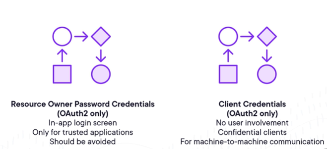

An access token does not need to be a jwt like an identity token (it often is).
See out access token:


The audience is not longer our client application but it is our api.
It also has reources at our IDP level as intended audience: we pass the access token when calling the user info endpoint and that requires an access token!
Client Id is also new and it represents the client application: on the identity token this was part of the audience array.
The other values are the same: scopes. We have the api scope to access the api but we also have identity related information scopes:

When we ask the user info endpoint it will return the information mapped to those scopes.
Lastly, we also see the authentication methods.

## Secure the API

Securing the APi is even more important than securing the client application. It is where the data resides.
We can secure the Webapi with Authorizaton code flow with PKCE as well.
It is very similar to the flow we saw before:

1. Our web app starts by creating a random string called a code_verifier. It hashes that code_verifier, and that hashed version is called the code_challenge.
2. web application creates an authentication request with response type code and includes the code_challenge. The web application sends the request, and at level of the identity provider, the code_challenge is stored
3. The user authenticates and the IDP optionally asks for consent
4. the identity provider redirects back to the web app with the authorization code in the URI.
5. The web application then calls the token endpoint authenticated with clientid and clientsecret, and it passes through the authorization code and the code_verifier.
6. The identity provider hashes this and checks if it matches the stored code_challenge, only if that's the case will the IDP return tokens.
7. We get an access token and identity token back. The identity token is validated at the level of the web client. Part of this validation is calculating the hash from the access token to see if it matches 'at' hash value in the identity token, so the access token takes part in the validation procedure of the identity token.
8. If validation checks out and a claims identity is created from the identity token, and that is used to sign into our ASP.NET Core MVC web application. We've also got an access token now.
9. Optionally we can request userinfo from the user info endpoint.
10. Because we are insterested in calling our api, the access token is stored and it is sent on every request to the API as a bearer token.
11. The token is validated at the api.

So the flow is very similar with the difference now calling the api using an access token.

In order to implement that we need:

1. At the identiy provider we need to add on our config an Api resource and an additional scope that the client can request:

```
   public static IEnumerable<ApiResource> ApiResources =>
   new ApiResource[]
   {
       new ApiResource("imagegalleryapi", "Image Gallerey API")
    };
        public static IEnumerable<Client> Clients =>
        new Client[]
            { new Client { ClientName = "Image Gallery" ,
                ClientId = "imagegalleryclient", // client app identifier
                AllowedGrantTypes = GrantTypes.Code, // authorization code flow
                RedirectUris = { "https://localhost:7184/signin-oidc" }, // client redirect uri
                PostLogoutRedirectUris = { "https://localhost:7184/signout-callback-oidc" },
                AllowedScopes =
                {
                    IdentityServerConstants.StandardScopes.OpenId,
                    IdentityServerConstants.StandardScopes.Profile,
                    "roles",
                    "imagegalleryapi"
                },
                ClientSecrets = { new Secret("secret".Sha256()) },
                RequireConsent = true,

            }

            };
```

2. In the hosting extensions class we need to add the Api resources:

```
       .AddInMemoryApiScopes(Config.ApiScopes)
       .AddInMemoryApiResources(Config.ApiResources)
```

As we can see we also have a list of api resources. So why did we add api resources and not scopes?

A scope is an old OAuth2 concept. It simply means the scope of access requested by a client. So a read scope would give a client read access at the level of the api, etc
It is a simple approach but not sufficient.
Resource is another concept more elaborate like a physical or logical api. In our case the image gallery api is a resource.
In more complex system we can have many apis, or we decide to split our api into modules or "logical apis" with each having it own resource name. Each api can have scopes, that will be used for more fine-grained control: as an exaple image gallery.read or write.scope.
it's not hard to imagine that different client applications that need access to our Image Gallery API are allowed different levels of access inside of that API:

Whenever a scope related to a resource is requested by a client application, the access token will contain the resource as an audience value, and the scope will be in the scopes list:
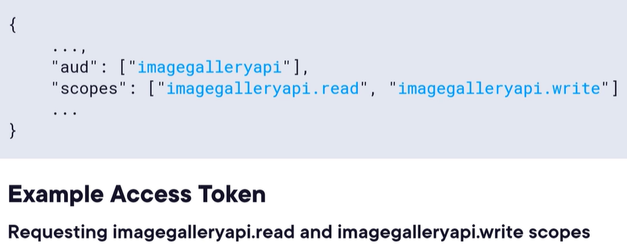
Other apps would be similar, like a mobile app that can only have read scopes at the api. Like this, you can use these scopes to build a fine‑grained authorization layer for your APP.
So the code above will be transformed into:

```
    public static IEnumerable<ApiScope> ApiScopes =>
       new ApiScope[]
           {
               new ApiScope("imagegalleryapi.fullaccess")
           };

   public static IEnumerable<ApiResource> ApiResources =>
   new ApiResource[]
   {
       new ApiResource("imagegalleryapi", "Image Gallerey API")
       {
           Scopes = { "imagegalleryapi.fullaccess" }
       }
   };
```

So basically when a client asks for imagegalleryapi.fullaccess scope it will get an access token with imagegalleryapi in the audience list and the requested scope in a list of scopes. We need to make sure that scopes is available to our client app:

```
      AllowedScopes =
     {
         IdentityServerConstants.StandardScopes.OpenId,
         IdentityServerConstants.StandardScopes.Profile,
         "roles",
         "imagegalleryapi.fullaccess"
     },
```

Now, on the level of the client app all we need to do is becase we are already receiving via the back channel an access token:

```
    options.Scope.Add("imagegalleryapi.fullaccess");
```

The last steps are on our API. We need to configure the API middleware to verify the access tokens.

1. First install asp.net package for jwtBearer.
2. Second we need to register the authentication services and configure them:

```
builder.Services.AddAuthentication(JwtBearerDefaults.AuthenticationScheme).AddJwtBearer(options =>
{
    options.Authority = "https://localhost:5001";
    // address of the identity provider.
    // The middleware uses this to load metadata so it knows about endpoints and keys. it will cache this information
    // it validates the access token
    options.Audience = "imagegalleryapi"; // checks for the audience that comes with the token.
        options.TokenValidationParameters = new()
    {
        ValidTypes = new[] { "at+jwt" },
        RoleClaimType = "role",
        NameClaimType = "given_name",
    };
});
```

The last step of ValidTypes is very new. This is done to avoid JWT confusion attacks. That's an attack that allowed APIs to become confused between quotation marks in regards to the tokens it would accept as valid.
It allowed attackers to circumvent token signature checking by providing an arbitrary token protected with an HMAC.
One way to mitigate this is via this type check. This didn't exist a few years ago, so this just goes to show how fast attacks are discovered and standards that mitigate them are developed
What I also prefer to do is ensure that the incoming claims and validation on those claims are mapped and executed the same way as they are on the client like on the API if both are under your control
Then configure the middleware:

```
app.UseAuthentication(); // order mattersn. should be before authorization and map controllers.
```

Then we decorate the controllers with Authorize attribute.
When we start our api on the consent screen we have a new section basically consenting access to the api.
The last step is to configure the client app to send the access token on the requests to the API.
There are several ways of doing it on an MVC app.
One way to do it is to add a delegate handler

1. We can add a reference to the package Duende.AccessTokenManagement.OpenIdConnect from the creators of the identity server. This is the packages for user centric flows
   For client credentials flow we would have Duende.AccessTokenManagement
2. Add in program the token management services
   builder.Services.AddOpenIdConnectAccessTokenManagement();
   builder.Services.AddHttpClient("APIClient", client =>
   {
   client.BaseAddress = new Uri(builder.Configuration["ImageGalleryAPIRoot"]);
   client.DefaultRequestHeaders.Clear();
   client.DefaultRequestHeaders.Add(HeaderNames.Accept, "application/json");
   }).AddUserAccessTokenHandler(); // sends the token on every request.
3. Now we see in the console logs the access token:
   When inspectings it we see :
   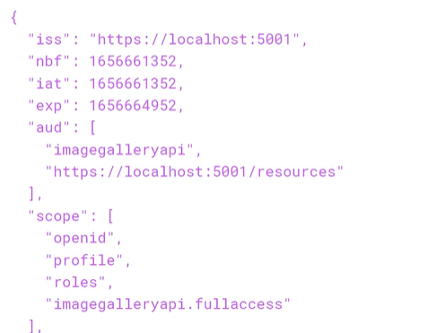
   We see more scopes than just the ones of our api. The call to the user info endpoint passes through this access token so it needs the profile and role scopes as well.
   That is why the idendity server is also in the list of audiences. In some IDP implementations that might not be the case because it is just assumed that the user info endpoint will be called.

Let's now make the api return the list of images related to a specific user.
We can access the user object from the controller class. By validating the access token, ASP.Net core gives us access to an user object.

```
 var userId = User.Claims.FirstOrDefault(c => c.Type == "sub")?.Value; // sub claim that identifies the user.

  var imagesFromRepo = await _galleryRepository.GetImagesAsync(userId); // pass the user to do the filtering in the repository
```

We also need to protect the other actions. If a malicious user knows the URI it can delete an image etc. Instead of repeating the previous piece of code on every action there is a more elegant wayt to do it.
We can even prevent the request to get to the controller action by implementing Policies. We will learn about policies in the next section.
But first, we need to add identity claims to the access token too. Until know we only have scopes.
We want to ensure aon our API the only users in the paying role can create images. First, at the identity provider we need to change our api scope to include the claims role:

```
    public static IEnumerable<ApiResource> ApiResources =>
    new ApiResource[]
    {
        new ApiResource("imagegalleryapi", "Image Gallerey API", new []{ "role" })
        {
            Scopes = { "imagegalleryapi.fullaccess" }
        }
    };
```

By just declaring the list of claims, while intializing the APi scope next time the scope is request, the role claims will be returned.
Onto protecting the API:
Lets decorate the Createe action of the controller with an Autorize attribue:

```

        [HttpPost()]
        [Authorize(Roles ="PayingUser")]
        public async Task<ActionResult<Image>> CreateImage([FromBody] ImageForCreation imageForCreation)
```

Also notice that the our DTO does not contain an user id. That is on purpose.
It is the responsibility of the API to inspect the token and fill that information out. For obvious security reasons. The user id comes from a signed and verified token, so we know this Id was not tampered.

```
            var userId = User.Claims.FirstOrDefault(c => c.Type == "sub")?.Value;
            if (userId == null)
            {
                throw new Exception("User identifier is missing.");
            }
            imageEntity.OwnerId = userId;

            // add and save.
            _galleryRepository.AddImage(imageEntity);
```

## Authorization policies

Nowadays authorization policies with attribute based access control are the approach considered more flexible. Even when compared to role base authorization.
They allow the setup of complex rules.
Here are the main differences between the two:
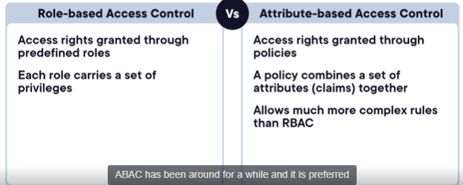
Techically a role can be an attribute of a policy. But a policy can have many attributes like: a user is allowed an action if has a certain role, lives in a certain city and was born within a certain date.

Asp.net core has built in support for policies.
Lets add the policy of allowing the user to add an image if he was born in Belgium.
We need to create a country claim for that. First on the identity provider. We also need to ensure our client can ask for that claim
So we add a new identity resource country for which we will return the country claim.
So we need to add that information to the each user.
Configure the client to ask for that claim.
The next step is to create an authorization policy. If we want to reuse the policies on both mvc client and api we can create a class library.
The policy will look like this:

```
        public static AuthorizationPolicy CanAddImage()
        {
            return new AuthorizationPolicyBuilder().RequireAuthenticatedUser().RequireClaim("country", "be").
                RequireRole("PayingUser").Build();
        }
```

On the mvc client Lets see the policy:

```
builder.Services.AddAuthorization(options => { options.AddPolicy("UserCanAddImage", AuthorizationPolicies.CanAddImage()); });
```

On our layout class we are replacing the check if the user is in role with a call to the Authorization service (it gets injected when we can add authorization):

```
 @if ((await AuthorizationService.AuthorizeAsync(User, "CanAddImage")).Succeeded)
 {

     <li class="nav-item">
         <a class="nav-link text-dark" asp-area="" asp-controller="Gallery" asp-action="AddImage">Add an Image</a>
     </li>

 }
```

Protecting the action is done with the attribute as well but instead of role we reference the policy:

```
        [HttpPost]
        [ValidateAntiForgeryToken]
        [Authorize(Policy = "UserCanAddImage")]
        //[Authorize(Roles = "PayingUser")]
        public async Task<IActionResult> AddImage(AddImageViewModel addImageViewModel)
        {}

```

We need to follow similar steps to use the policy on our api in program cs and add a similar attribute to the controller.
The thing is that the access token also needs to contain the new country claim, otherwise authorization will not work.
So at level of the IDP we need to include on the api resource the new claim:

```
   new ApiResource("imagegalleryapi", "Image Gallerey API", new []{ "role", "country"})
   {
       Scopes = { "imagegalleryapi.fullaccess" }
   }
```

We can improve our policies. We can leverage scopes inside the api to check whether something is allowed.
We are now talking about users not involved but more about what client application are allowed to do.
It is another level of authorization.
Because this is an api only policy, in this small project does not make sense to share it in a library.
We can define directly the policy on our api when we configure the authorization middleware:

```
    options.AddPolicy("ClientApplicationCanWrite", policyBuilder => policyBuilder.RequireClaim("scope", "imagegalleryapi.write"));
    // apply then in the controller

```

We add the scopes to API scopes at our level of the identity provider and link them to the api resource:

```
        new ApiResource("imagegalleryapi", "Image Gallerey API", new []{ "role", "country"})
        {
            Scopes = { "imagegalleryapi.fullaccess", "imagegalleryapi.read", "imagegalleryapi.write" }
        }

        // htey need to be present on the list of api scopes
```

Configure the allowed scopes for the client:

```
    { new Client { ClientName = "Image Gallery" ,
        ClientId = "imagegalleryclient", // client app identifier
        AllowedGrantTypes = GrantTypes.Code, // authorization code flow
        RedirectUris = { "https://localhost:7184/signin-oidc" }, // client redirect uri
        PostLogoutRedirectUris = { "https://localhost:7184/signout-callback-oidc" },
        AllowedScopes =
        {
            IdentityServerConstants.StandardScopes.OpenId,
            IdentityServerConstants.StandardScopes.Profile,
            "roles",
            //"imagegalleryapi.fullaccess",
            "imagegalleryapi.read",
            "country"
        },
        ClientSecrets = { new Secret("secret".Sha256()) },
        RequireConsent = true,
    }
    };
```

So we can see that the client can ask for read only. As last step we configure the client application to ask for this scope
By trying to create an image we then see forbidden.
If we add "imagegalleryapi.write" to the allowed scopes we will be authorized to perform the operation.

## Policies with requirements and handlers

The built in policies are great for simple cases. When more complex rules are required, like boolean operators, route data access, repository access, etc..
we can extend policies with requirements and handlers.
Last example we decorated an api action and it ended with two attributes, one for each policy.
All policies need to be valid. A policy has a set of requirements. So far we used built in requirements like RequireClaim, etc
We can build custom requirements by implementing the IAuthorizationRequirement interface.
There is also the concept of handlers. AutorizatonHandler<T>
where T is of type requirement.
If none of the requirement handlers fail and one of them returns true, the requirement is met.
It is on those handlers more complex logic resides: like calling repo to check if a user owns an image.

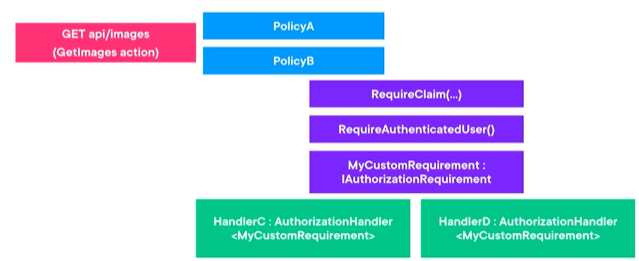

We can build a full fledged authorization layer.
How to create a custom policy:

1. Define a requirement :

```
    public class MustOwnImageRequirement : IAuthorizationRequirement
    {
        public MustOwnImageRequirement()
        {

        }
    }
```

2. Define the requirement handler. We inject the repository and http accessor to run our logic:

```
    public class MustOwnImageHandler : AuthorizationHandler<MustOwnImageRequirement>
    {
        private readonly IGalleryRepository _galleryRepository;
        private readonly IHttpContextAccessor _contextAccessor;

        public MustOwnImageHandler(IHttpContextAccessor httpContextAccessor, IGalleryRepository galleryRepository)
        {
            _contextAccessor = httpContextAccessor;
            _galleryRepository = galleryRepository;
        }
        protected override async Task HandleRequirementAsync(AuthorizationHandlerContext context, MustOwnImageRequirement requirement)
        {
            var imageId = _contextAccessor.HttpContext?.GetRouteValue("id")?.ToString();
            if (!Guid.TryParse(imageId, out Guid idAsGuid))
            {
                context.Fail();
                return;
            }

            var imagerOwner = (await _galleryRepository.GetImageAsync(idAsGuid))?.OwnerId;

            if (context.User.Claims.FirstOrDefault(c => c.Type == "sub")?.Value == imagerOwner)
            {
                context.Succeed(requirement);
            }
        }
    }
```

3. Add the policy to the policy builder:

```

builder.Services.AddAuthorization(options => {
    options.AddPolicy("UserCanAddImage", AuthorizationPolicies.CanAddImage());
    options.AddPolicy("ClientApplicationCanWrite", policyBuilder => policyBuilder.RequireClaim("scope", "imagegalleryapi.write"));
    options.AddPolicy("MustOwnImage", policyBuilder =>
    {
        policyBuilder.RequireAuthenticatedUser();
        policyBuilder.AddRequirements(new MustOwnImageRequirement());
    });
});
```

4. Add the required services to the IoC container:

```
builder.Services.AddScoped<IAuthorizationHandler, MustOwnImageHandler>();
builder.Services.AddHttpContextAccessor();
```

5. Decorate the actions with the authorize attribute. Authorization layer built.

It is also possible to use custom attributes instead of the Authorize attribute. It can make the application a little more maintainable.
Having the requirement and handler in place it is actually quite easy:

```
    public class MustOwnImageAttribute : AuthorizeAttribute, IAuthorizationRequirementData
    {
        public IEnumerable<IAuthorizationRequirement> GetRequirements()
        {
            return new[] { new MustOwnImageRequirement() };
        }
    }
```

Notice the interface implemented and the base class. The apply the attribute in the actions.

## Managing Tokens

Tokens have a life time. They expire. The defaults of the identity server are the following:

After the expiration time, the token is not valid to create a claims identity from it.
SOme clients have their own policies. For example, if the user is active on the app it should be kept as logged in.
Access tokens usually have a longer life time compared to identity tokens:
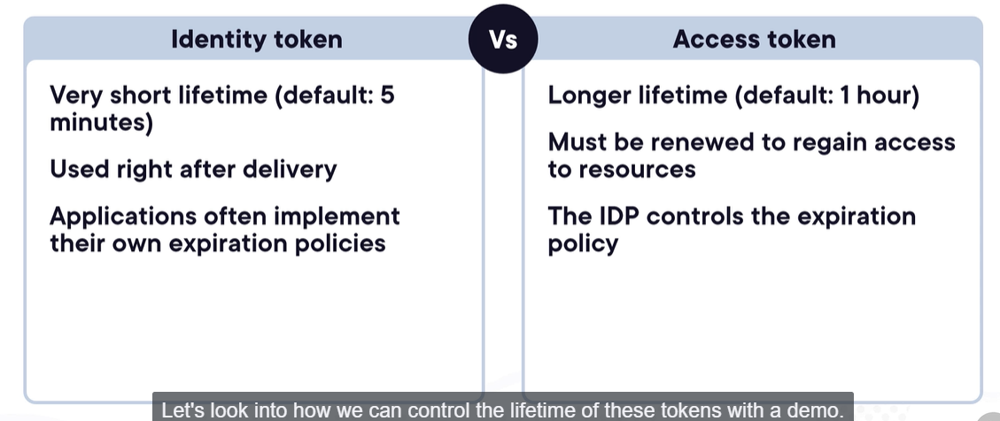

When configuring the client at the level of the IDP we can configure the expiration settings for the token and authorization code:

```
       //IdentityTokenLifetime = 300
      //AuthorizationCodeLifetime = 300
      AccessTokenLifetime = 120,

```

The asp.net core api allows for a 5 min extra to accomodate of out of sync clock between servers.
We can configure though long lived access to the api by using refresh tokens for confidential clients.
This improves user experience by avoiding redirection to the IDP.
This is the refresh token flow:
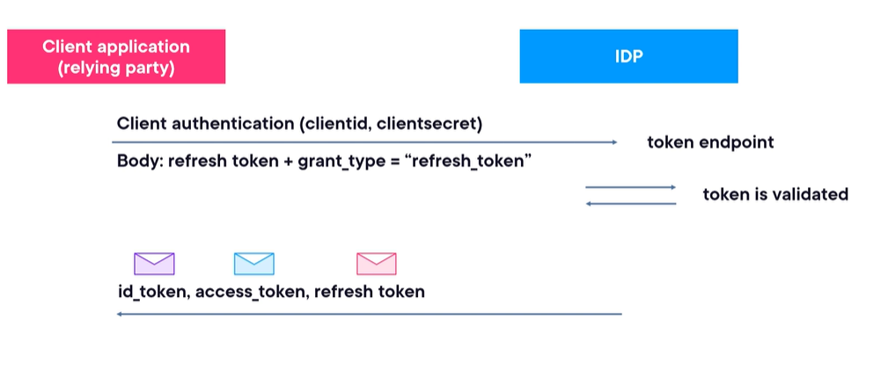
To allow the use of refresh tokens we need to request the scope "offline_access". Offline, in this context, means that the user is not logged in at the level of the identity provider.
This is how we allow this scope:

```
AllowOfflineAccess = true,
UpdateAccessTokenClaimsOnRefresh = true, // Refresh the claims. The default expiration is 30 days so it is important to refresh because claims might change.
```

Refresh tokens usually have a much longer lifetime than access tokens.
You can reduce their exposure by adding a sliding lifetime on top of the absolute lifetime.
This allows for scenarios where a refresh token can be silently used if the user is regularly using the client, but needs a fresh authorize request if the client has not been used for a certain time.
In other words, they auto-expire much quicker without potentially interfering with the typical usage pattern.
In our mvc app, by adding this line, we configured the middleware to get refresh tokens automatically when they are about to expire:

```
.AddUserAccessTokenHandler();
```

## Reference Tokens

Until now we worked with self contained tokens, jwts. We can validate it locally without calling every time the identity provider.
It is not easy to control the lifetime of the token. Sometimes we need to revoke immediatly tokens when used to access sensitive data.
Or when a system has been compromised. This is where reference tokens come into plays.
Reference tokens are just identifiers linked to a grant result/ set of permissions that normally would be in the JWT, stored at level of the IDP.
When we use the reference token to access our api, the token is sent to the IDP via the back channel, validated and the content is sent back to the API.
This process is called introspection. It uses the introspections endpoint. It has more direct control over hte lifetime but the problem is that on every request we go to the IDP.
At the level of the identity provider, when configuring the client, there is a property called 'AccessTokenType'.
If we set that a reference, the client will be working with reference tokens.
Right after doing that, we will get unauthorized. That is because our api is accepting jwt tokens. We can configure and extra piece of middleware to accept reference tokens.
Basically our api will call the introspection endpoint of the IDP.
The introspection endpoint needs authentication too so we need to define a secret for our api, so it can call the introspection endpoint:

```
// api resource at the level of the idp
        new ApiResource("imagegalleryapi", "Image Gallerey API", new []{ "role", "country"})
        {
            Scopes = { "imagegalleryapi.fullaccess", "imagegalleryapi.read", "imagegalleryapi.write" },
            ApiSecrets =  { new Secret("apisecret".Sha256())},
        }
```

At the level of the api we add a new nugget package, comment out the jwt token code and add the following configuration:

```
AddOAuth2Introspection(options =>
{
    options.AuthenticationType = "https://localhost:5001";
    options.ClientSecret = "apisecret";
    options.ClientId = "imagegalleryapi";
    options.NameClaimType = "given_name";
    options.RoleClaimType = "role";
});
```

Reference tokens can be revoked. Ways to do it:

1. Administration tool. The admin can revoke the token by deleting the token from the token store of the idenity server.
1. From a client application might do this when a user logs out. Call token revocation endpoint.

Revoking a token from the client application:

1. Add a named http client:

```
builder.Services.AddHttpClient("IDPClient", client =>
{
    client.BaseAddress = new Uri("https://localhost:5001");
});
```

2. On the logout action use the http client to revoke the token:

```
            var client = _httpClientFactory.CreateClient("IDPClient");
            var discoveryDocument = await client.GetDiscoveryDocumentAsync(); // nugget packge fetches the metadata from the idp
            if (discoveryDocument.IsError)
            {
                throw new Exception(discoveryDocument.Error);
            }

           await client.RevokeTokenAsync(new TokenRevocationRequest
            {
                Address = discoveryDocument.RevocationEndpoint,
                ClientId = "imagegalleryclient",
                ClientSecret = "secret",
                Token = await HttpContext.GetTokenAsync(OpenIdConnectParameterNames.AccessToken)

            });
```

We can revoke refresh tokens as well.

## Token validation

Token validation is usually something we do not do ourselves. We let the middlewares do it.
Validation procedures are different depending on the flows used.
Not every IDP uses the same validation procedures. The same for clients.
Lets cover the authorization code flow we have been using:

1. The identity token: because our identity token signs tokens, the signature must be validated.
1. The nonce claim must also be checked. This must match the value sent by the client on theauthentication request.
1. The issues must mathc the issue identifier of the identity provider.
1. The audience must match the client id value. We test the idenity token was issued to be used by our application.
1. Expiration.
1. At hash value. Acces token hash generated by the identity provider. At client level hash is created from ASCII representation of the access token.
   We take the left most half of the hash Base64 url encode it. it must match the at hash of the `at` has value.

Additional steps are possible like manual encryption and decryption.
The client does not validate the access token. That is the api.
OAuth2 does not specify how to validate such tokens.
One way to do it is to call the introspection endpoint if using referente tokens.
For self contained tokens:

1. Signature validate
1. Issues must match our IDP.
1. Expiration
1. Audience claim

## Generate tokens for testing

For testing the api there are several ways to generate tokens and test the api authorization layer.
One of them is to add a custom endpoint to do it. We can use built in asp.net core classes to do it. Check the API fundamentals course.
These are custom tokens that do not offer the same protection as OAuth and OpenIdConnect access tokens.
There is a tool from microsoft that can be used to generate tokens. We can use that to generate tokens. These tokens are not also the standard ones.
We need to take into account the following, when user this cli tool to generate the tokens:

1. the issuer needs to be the same as our IDP
1. The signing key as well, that gets generated when the identity server starts up.

This tool does not work with reference tokens, given the fact these tokens are supposed to be linked to real access tokens.
If we comment out the audience, on our configuration, we can observe when we create a default jwt using this cli tool, we see that asp.net core creates configuration entries automatically on our app settings.

```
dotnet user-jwts create
```

The key gets picked from our local machine.
This create a token. Now we can use --claims flag --audience flag to manipulate a generate token with audience and claims we want to test the authorization layer of our api.
This tool also behaves like a store. We can list all the tokens we generate. We also have options to remove from the store etc.

## Securing Javascript clients

Go here..

## Managing users

Openid connect does not directly deal with credentials. What this means, is that the means of authentication of an end user, are beyond the scope of teh standard.
The standard just specifies that a user needs to authenticate or be authenticated, before provifing proof who the user is to the client application.
Various means of authentication exist:

1. Good old user name and password
2. Biometrics
3. Providing a smartphone or hardware token, like an authenticator app.
4. Transaction authentication (finding the ip is from a different location, etc).

Nowadays, it is more common using more than just one form of authentication, the famous MFA: multi factor authentication.
We also need to take into account where the credentials are stored. Most of the time, locally on the identity provider with a local database. Sometimes, in other places, like for example, in active directory.
In this case, we have active directory integration. It is common as well people having accounts in other places like google, facebook, etc that can be used to identify a person.
So handling all these integrations is another argument to have everything handled centrally at the level of IDP. So we can add more providers, more apps, etc.
One option is to implement all of this manually (custom implementation, takes time but more flexible).
Some companies have already mechanisms in place that can be impossible to integrate with off-the-shelf products. It is important to avoid security holes.
Another option is to implement ASP.NET core identity.
It is an API to manage users, passwords, etc. We can look into it as a bunch of screens for user management combined with a data store.
It does not support nor implement OAuth2 or OpenID Connect (it supports generation of tokens.)
So it is very often used with Identity server.
On a side note, Asp.Net core identity should not be confused with Entra AD and AD B2C - Microsoft Identity Framework (an umbrella for all these things related to IAM on Azure).
We will do it at the level of the IDP to allow for federation scenarios.
When starting a new project we should check asp.net core identity. If we need custom work or end up in a situation with existing IAM/users we will end up with a custom implementation.
We are now going for a custom implementation to learn how all of this works.

## Building database schema

Let's start simpl: two tables (Users and UserClaims with a relationship one-to-many).
See the initial schema:

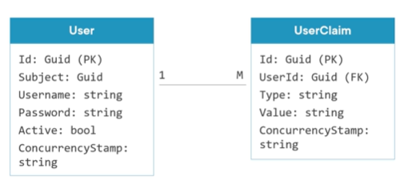

Concurrency stamp helps avoiding concurrency issues while updating the users. When a user is saved the concurrency value is changed. So if updating almost at the same time it will fail because the value will not match.
We added SQL lite and EF core as our data access layer. Out of the box, identity server does not come with a user interface. We need to add it or write ourselves. How does this user interface interact with Identity server internals? It uses the IIdentityServerInteractionService. The UI assets we use come from duende itself.
This interface provides access to resources like the authorization request context, that will contain information about the client, redirect URI etc.
We are already injecting it on our login page, together with other components like the scheme provider that gives us information about the scheme.
We can see as well the IdentityProviderStore that contains additional IDP integrations.
We also see IEventService that is used to raise events like, LoginSuccessful etc.
The page has a method get to generate and show the login view. The BuildModelAsync fill the model to go with the view:

```
var context = await _interaction.GetAuthorizationContextAsync(returnUrl);
if (context?.IdP != null && await _schemeProvider.GetSchemeAsync(context.IdP) != null)
{
    var local = context.IdP == Duende.IdentityServer.IdentityServerConstants.LocalIdentityProvider;

    // this is meant to short circuit the UI and only trigger the one external IdP
    View = new ViewModel
    {
        EnableLocalLogin = local,
    };

    Input.Username = context.LoginHint;

    if (!local)
    {
        View.ExternalProviders = new[] { new ViewModel.ExternalProvider ( authenticationScheme: context.IdP ) };
    }

    return;
}

```

This piece of code here is basically a shortcut, that handles the situation we bypass the identity server and go straight to an external identity provider. So it is basically using identity server as proxy.
When we have more than one, then the other piece of code is executed:

```
        var schemes = await _schemeProvider.GetAllSchemesAsync();

        var providers = schemes
            .Where(x => x.DisplayName != null)
            .Select(x => new ViewModel.ExternalProvider
            (
                authenticationScheme: x.Name,
                displayName: x.DisplayName ?? x.Name
            )).ToList();

        var dynamicSchemes = (await _identityProviderStore.GetAllSchemeNamesAsync())
            .Where(x => x.Enabled)
            .Select(x => new ViewModel.ExternalProvider
            (
                authenticationScheme: x.Scheme,
                displayName: x.DisplayName ?? x.Scheme
            ));
        providers.AddRange(dynamicSchemes);
```

For each external provider (like google, facebook, etc) a new button gets inserted in the login page.
The OnPost method is where the username and password combination gets checked. If all the conditions are verified, a cookie is created.
So this interaction service is what we use, to fetch data from the http context, to check on each point of the flow we are in, etc.
Now lets integrate with our custom user store. For the we added a LocalUserService and added it to the IoC container. We inject it on our login page and get rid of test user store.
This service goes and fetches the data from our local database.
We then need to use the IProfileService. This is the service that will allow us to include the user individual claims in the token. So far when we added the tests user, it would add a test user profile service to the IoC container. That is how identity server knows how to include user information.
Our profile service (better than adding it to the cookies):

```
    public class LocalUserProfileService : IProfileService
    {
        private readonly ILocalUserService _localUserService;
        public LocalUserProfileService(ILocalUserService localUserService)
        {
            _localUserService = localUserService;
        }

        public async Task GetProfileDataAsync(ProfileDataRequestContext context)
        {
            var subject = context.Subject.GetSubjectId();
            var claims = await _localUserService.GetUserClaimsBySubjectAsync(subject);
            context.AddRequestedClaims(claims.Select(c => new System.Security.Claims.Claim(c.Type, c.Value))); // write claims on the context
        }

        public async Task IsActiveAsync(IsActiveContext context)
        {
            var subject = context.Subject.GetSubjectId();
            context.IsActive = await _localUserService.IsUserActive(subject);

        }
    }
```

## Managing users

Thare are several approach to implement the functionality to add users, deactivate users, etc. From secutiry point of view many aproaches are valid: host the screens at the idp level, a separate app or a mixed of both..
These are the questions to ask if we want to separate the user management:

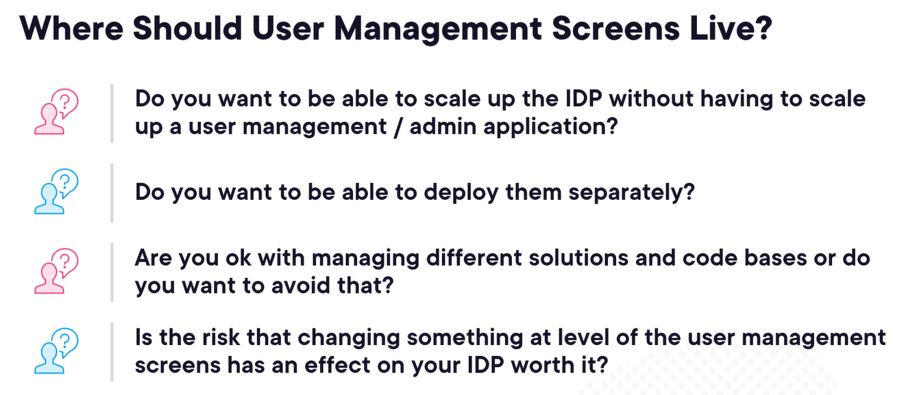
On this demo we choose to do it at the level of the identity provider.
So lets add a link to the url of user registration.
We create a page on the level of our identity provider. We created folder User/Registration.
We add a new razor page and inject the necessary services. The Input model contains the properties that will be bound to the view and as such we need to build with the OnGetMethod:

```
       public IActionResult OnGet(string returnUrl)
      {
          BuildModel(returnUrl);
          return Page();
      }
```

On the OnPost, we fetch the data from the view and build a user object and store it on our local database. After that, we redirect the user as a logged-in user with access to the app.

### Safely storing passwords

Passwords should be stored after being salted, hashed and key-streched.
They should never be stored as plain text.
A salt is a cryptographically random piece of data that is attached to the password before it is hashed.
It means that a salt serves as additional input for a hashing function and it is stored next to the password in the database.
Usually a cryptographically secure Pseudorandom number generator is used for this. So the salt is very unpredicatble and it protects us of Lookup table attack and rainbow table attack.
Hashing is a one-way transformation on a password which turns the password into another string.
Two famous hashing algorithms are SHA256/SHA512. Hashing is different that encryption.
Encryption is a two way transformation: you can decrypt something back to its original value after having it encrypted, while a hash cannot be dehased.
So hashing protects against the password being decrypted and a salt protects us from the aforementioned attacks:

1. Lookup attack: tries to crack a hash. The idea is to compute the hashes and their respective passwords and stroring them in a dictionary or other lookup data structure that is used to search for the hash.
2. Rainbow table: like a lookup table, but here the lookup tables are made smalller by sacrificing hash cracking speed.
   So applying a salt will make sure that our hashed version of the password does not match the the version on the lookup tables. These tables would need to compute all combinations of hashing and salting, etc.

Lastly, key stretching is a technique to discourage brute forcing a password by hashing it 1000s instead of just once.
Imagine a scenario has our hashing password and a salt (probably have access to our database). So our application data is not secure.
So they have the hash and the salt but not the original password. So they can brute force it: try every possible combination starting with common passworsds and compare.
So if we hash a 1000 times instead of one, it will take 1 or 2 seconds. That means it will take 1 or 2 seconds for the attacker to compute each comnbination. With millions possible combinations...
That means the user loggin in will take those 2 seconds but that is ok.
PBKDF2 and Argon 2 implement key stretching/ key derivation. The process looks like this:

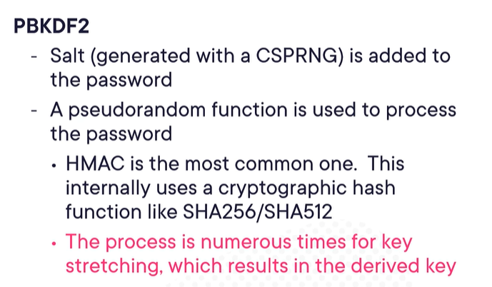
As computer power goes up, more iterations will be needed and, of course, keeping up to date with security practices.
Accomplish this in ASP.NET core is actually simple:

We need to inject the IPasswordHasher interface in our local user service:

```
            userToAdd.Password = _passwordHasher.HashPassword(userToAdd, password);
```

We can look into the code in the ASP.Net core repo, but here it is some information about it:


We also need to verify the password now against the hased version:

```
            var verificationResult = _passwordHasher.VerifyHashedPassword(user, user.Password, password);
            return verificationResult == PasswordVerificationResult.Success;
```

### Activating accounts

When activating accounts is good practice to verify that the e-mail is unique.
E-mail becomes a central piece on itegrations with federated other federated services.
The activation flow is simple:

We will generate an activation link with expiration date of one hour. The idea is to send an email so the user can click on that link.
While registering the user, we generate an activation code and store it in the database, along with the expiration date. When the user clicks on the link it will need to pass the code.
For that we need another page as well. The page the user will be redirected when clicking on that link: verify folder /user/activation.
We add this code while adding a user:

```
            if (_context.Users.Any(u => u.Email == userToAdd.Email))
            {
                // in a real-life scenario you'll probably want to
                // return this as a validation issue
                throw new Exception("Email must be unique");
            }

            userToAdd.SecurityCode = Convert.ToBase64String(RandomNumberGenerator.GetBytes(128));
            userToAdd.SecurityCodeExpirationDate = DateTime.UtcNow.AddHours(1);
```

On the local user service we also added the following code:

```
public async Task<bool> ActivateUserAsync(string securityCode)
{
    if (string.IsNullOrWhiteSpace(securityCode))
    {
        throw new ArgumentNullException(nameof(securityCode));
    }

    // find an user with this security code as an active security code.
    var user = await _context.Users.FirstOrDefaultAsync(u =>
        u.SecurityCode == securityCode &&
        u.SecurityCodeExpirationDate >= DateTime.UtcNow);

    if (user == null)
    {
        return false;
    }

    user.Active = true;
    user.SecurityCode = null; //subsequent requests will fail because the user will already be active
    return true;
}
```

Because we do not have yet an email server configured, we can use this to simulate the action of clicking the url that is generated here:

```
            var activationLink = Url.PageLink("/user/activation/index",
                values: new { securityCode = userToCreate.SecurityCode });
                 Debug.WriteLine($"Activation link: {activationLink}"); // log it on the console so we can click it
```

We commented out the code to sign in the user and generate the cookie because we want to do that when the user is active.
We instead redirect to a page that urges the user to check their e-mail:

```
return Redirect("~/User/ActivationCodeSent");
```

Then on our console log we see a generated link that would show up on the email, that send the code as a query parameter:
https://localhost:5001/User/Activation?securityCode=MUdPO4%2BK0mD7tPe5CYep5hD5NofZxv7KnmaQE9Ww9qNYAyxdx756fQ16txjTx09WKv6hITHS%2BVUpo7cdt%2FA17slqhTt7X6n8n8iBWBXfQBKVegyHjrOnZnz5PfxcSHOR3d0uzirtkCQyUa4kihYQkArMQIXUWY68hhsOeSvbTxs%3D

Some tips on IAM systems
Some IAM systems are different than others. Some allow users to manage their profile information.
If we do that, it is good practice to verify the email before starting using it by sending a confirmation link with a token.
Consider implement resend link functionality because as we have seen, codes expire and links need to be resent.
For password resets, identity must be verified first of course, before allowing the user to change their password (common questions should be avoided).
Implement blocking out users after unsuccessful login attempts, Probably not a good idea to lock out forever because we need a recovery mechanism.
Even locking out for a few minutes may cause a DoS attack, when the attacker disables hundreds of accounts. Key stretching like we did is an effective way to discourage brute force already. Adding a captcha is also a good way.

A note on passwords: longer passwords are better than small passwords with special characters. Forcing the user to change regularly may be not the best idea because most users use variations of the same password.
So, what are good practices? This picture summarizes it:
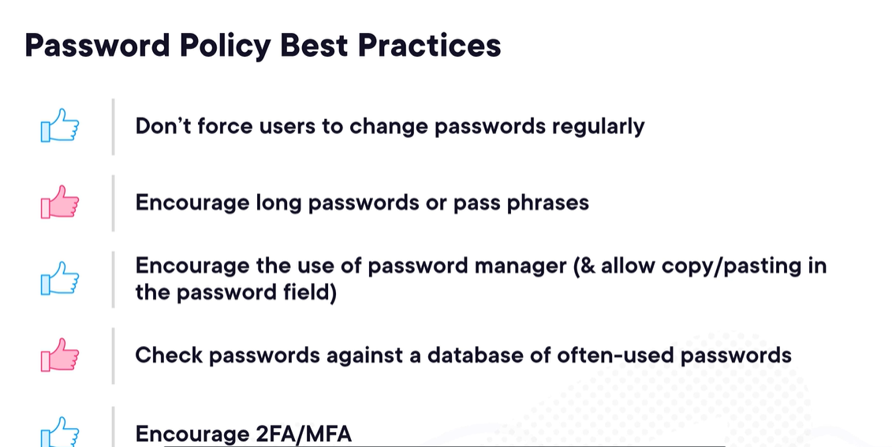

## Integration with AD and other social logins

A user might have account with credentials in many placesÇ

1. locally
2. Windows credentials
3. Microsoft Entra ID credentials
4. Social credentials

Users like to use the same account to log in everywhere. When to handle these integrations\_
It is not a good idea to handle that in the client application.
We would need to work around the fact a user can have facebook account and a local account on our identity server integration (we would end up with repeated users).
The other issue is that the claims might be different between providers, so we would need an extra layer of mappping.
Or we can have claims that do not exist on facebook at all.
SO the logic to handle this can be centralized and it is complex to have the client handle it.
So we do it at the IDP level. Remember: client only needs proof of identity.

### Windows authentication

In this scenario we are using corporate network's active directory domain identiy.
It is around for ages.
This one does not cover OAuth2 and OpendIdConnect.
It is better for intranet environments.
Credentials are not stored in our IDO but on active directory.
Windows authentication follows this sequence of steps:

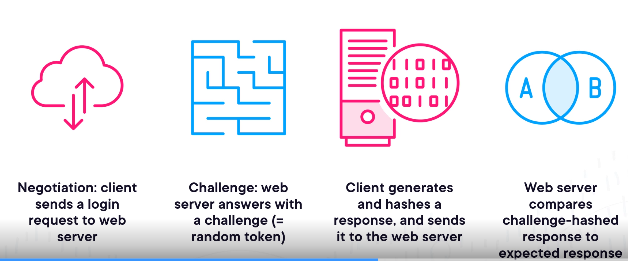

These messages, negotiation, challenge means that we are using NTLM protocol.
It is a proprietary authentication protocol from Microsoft. NT LAN MAN. Nt stands for windows NT.
This is one of the ways to achieve windows authentications. IIS uses this protocol but alternative protocol called Kerberos can be used.
The clients identity is proven with this challenge response.
Identity server supports windows aurthentication when it is hosted in Kestrel on windows with IIS and the IIS integration packages or HTTP.sys.
First, we need to add a iis profile on our launchSettings.json.
We need to host the application using iss. So we need to add some settings as well:

```
  "iisSettings": {
    "windowsAuthentication": true,
    "anonymousAuthentication": true, // requests to the discovery document are anonymous so without this our provider would not work
    "iisExpress": {
      "applicationUrl": "https://localhost:44300",
      "sslPort": 44300 // when running on SSL in IIS ports must be between 44300 and 44399
    }
  }
```

By changing the port we run the app, because it is imposed on us because of iss, we need to change the authority on our api and client application.
Under windows folder, we created a page for windows authentication:

```
            // see if windows auth has already been requested and succeeded
            var result = await HttpContext.AuthenticateAsync("Windows");
            if (result?.Principal is WindowsPrincipal wp)
            {
                // beware the performance penalty for loading these group claims
                var wi = wp.Identity as WindowsIdentity;
                var groups = wi.Groups.Translate(typeof(NTAccount));
                var roles = groups.Select(x => new Claim(JwtClaimTypes.Role, x.Value));

                var user = new IdentityServerUser(wp.FindFirst(ClaimTypes.PrimarySid).Value)
                {
                    IdentityProvider = "Windows",
                    DisplayName = wp.Identity.Name,
                    AdditionalClaims = roles.ToList(),
                };

                await HttpContext.SignInAsync(user);
                return LocalRedirect(returnUrl);
            }
            else
            {
                // trigger windows auth, the first time we follow in this challenge code
                // since windows auth don't support the redirect uri,
                // this URL is re-triggered when we call challenge
                return Challenge("Windows");
            }
```

1. First we fall on the challenge.
2. Second, after the challenge, the page reloads, and we authenticate the windows principals.
3. Identity server user is created.
4. The we sign and create local cookie and we then are signed on the the identity server.

Before getting things ready we need to have a way to show on the UI windows authentication. On the login page, we see the identity server renders ui elements for all external providers.
So we need to add windows authentication to the hosting extensions:

```
        // configures IIS out-of-proc settings
        builder.Services.Configure<IISOptions>(iis =>
        {
            iis.AuthenticationDisplayName = "Windows";
            iis.AutomaticAuthentication = false;
        });
        // ..or configures IIS in-proc settings
        builder.Services.Configure<IISServerOptions>(iis =>
        {
            iis.AuthenticationDisplayName = "Windows";
            iis.AutomaticAuthentication = false; // authentication goes through the custom code we just added.
        });
```

When we execute the code we developed so far, we get automatically redirected to ExternalLogin/Challenge. It means identity server is handling windows authentication as any other external means of authentication. We want to redirect to our windows page we just created.
So on the login page, on the section we render the buttons for the external providers, we add the redirection in case of windows authentication:

```
            @if (provider.AuthenticationScheme == "Windows")


            {
                                                        <a class="btn btn-secondary"
                   asp-page="/Windows/Index"
                   asp-route-scheme="@provider.AuthenticationScheme"
                   asp-route-returnUrl="@Model.Input.ReturnUrl">
                    @provider.DisplayName
                </a>
                }

```

We will notice this is not enough. We are checking on our profile service if a user is active. The subject Id of our windows user in to on our local user store yet.
All windows users have a primarySId and that is what we are using as a value for the subject when we create the IdentityServerUser object.
What we need to do is to implement account and user linking, which we will do in the module HEEEERE.

### Federation

The windows authentication apperar often on enterprise scenarios. Lately, Azure active directory as well (or entra id).
But for other apps, there are plenty of of other providers: users have facebook accounts, google, etc and like to use those accounts to log in in many applications.
This is the concept of federation: it shifts a lot of IAM complexities to a third party IDP. This also entails linking user identities.
Identity server can easily do that.
So our client app needs an identity token, so the user needs to be signed at the level of our IDP. So our client asks the IDP and the IDP will ask facebook for example. It will validate the token that came from facebook and it will validate and it will use to authenticate the user.
The protocol used by the third-party provider can vary: it can use openId as well, or SAML like active directory, etc.

On the external login folder of our identity provider project we have two pages: Challenge and Callback.
We also had that with windows authentication. The idea behind the challenging a scheme linked to an external identity provider is that it initiates the round trip to that identity provider. Once we come back from that idenity provider, we need to process the result, and that is done on the callback page. The rest of the flow is handled by the middleware.

The OnGet of the challenge page accepts a scheme name and a return url of course. it returns a challenge result: the result of asp.net core authentication managener challenge command, or, the built in authentication of asp.net core.
Challenge is part of controller base and by calling the "scheme" name is challenged: whatever middleware we defined that matches the provider name as scheme will be triggered.
In the code we see we can send the authentication properties to the challenge method: the scheme and the return URL. These properties we want them back on our callback page, the page we are in after the round trip to the external identity provider.
This is very similar to the flow we have of our client app and identity provider. Now, our idenity provider is like the "client" of the external idenity provider.
Now looking into our callback page OnGet method:

```
      var result = await HttpContext.AuthenticateAsync(IdentityServerConstants.ExternalCookieAuthenticationScheme);
      if (result.Succeeded != true)
      {
          throw new InvalidOperationException($"External authentication error: { result.Failure }");
      }
```

First, we get the user from the temporary cookie. That cookie was created by the middleware that matches the scheme that was triggered in the previous step. So we will have an Azure AD, or facebbok scheme, that will result in middleware being triggered that will result in writting this cookie.
After we will try to find the claims. How that is done will depend on the external provider (need to search the claim names of the external provider).

```
        CaptureExternalLoginContext(result, additionalLocalClaims, localSignInProps);
```

On very common thing to do is to store the identiy cookie that comes from the external idenity provider, so it can be used to automate signing out. Then idenity server user is created, etc. and we use to sign to our local idp. So at this point we can delete the tempory cookie because we do not need it anymore.

```
        // delete temporary cookie used during external authentication
        await HttpContext.SignOutAsync(IdentityServerConstants.ExternalCookieAuthenticationScheme);
```

### Integrating with Azure Ad

Azure AD our Entra Id is part of microsoft enterprise identity service with signle sign-on, multi factor authentication.
Assuming an active directory already exists, the first step is to create an app registration, on the app registration menu:

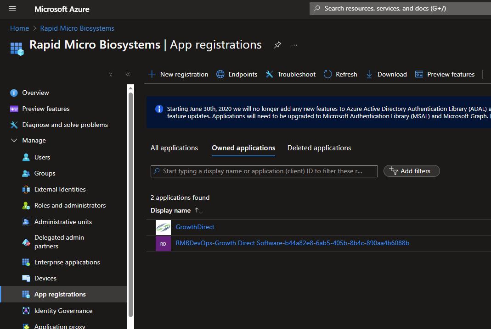

So we need to tell it is a web application and the redirect link: so our app is running on our localhost 44300 and this what we configure:

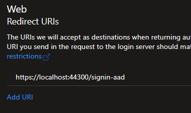

A note to make this work is that the url needs the slash at the end: https://localhost:44300/signin-aad/
We can continue the configuration and configure the front-channel logout URL, to redirect to our identity provider and cleanup session, etc

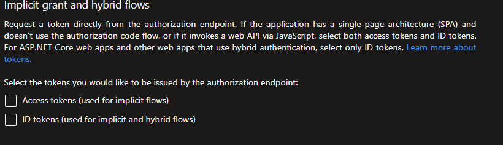

We do not want implicit grant. Recalling the authorization code flow we do not issue access tokens directly from the authorization endpoint.
The next step is to add a secret. For web apps, client authentication should be enabled.
On the menu of certificates and secrets we create a new secret and note it.
We can add permissions too. As default we are allowed to read the user profile from the Microsoft Graph. We can also request permissions to a set of microsoft apis or even our our apis, in case we have both.
By clicking on microsoft graph we can request addtional permissions. We can see some standard openId permissions:

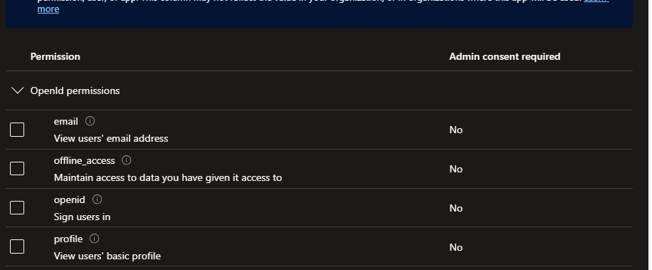
We selected all open id permissions.

On the overview page, we see the Azure created an unique client Id for our application.
We also are going need our tenant Id, so our IDP know which instance of AD to use.

So lets navigate to the endpoints tab and, on it, we can see a list of all the urls. All of them have on their url the tenant id we noted down.
We can have a look into the open id connect metadata document and fetch the issuer:
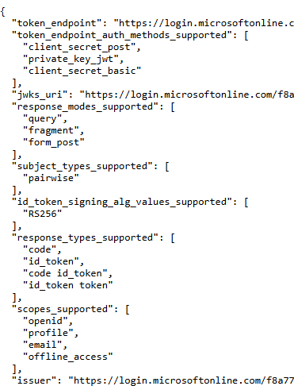
We are going to need the issuer as we've seen in previous examples.
Now we need to configure the services to integrate with Entra Id at the level of IDP:

```
        builder.Services
    .AddAuthentication()
    .AddOpenIdConnect("AAD", "Azure Active Directory", options =>
    {
        options.SignInScheme = IdentityServerConstants.ExternalCookieAuthenticationScheme; // the scheme that will be used to store the result of the authentication
        options.Authority = "https://login.microsoftonline.com/621cb4b2-eeb8-4699-913d-a651c392babd/v2.0";
        options.ClientId = "df55658d-e228-4f72-9f11-b60334edb0e2"; // the client of the app we registered in active directory
        options.ClientSecret = ""; // git hub blocks the push so we included the secret using dotnet secrets
        options.ResponseType = "code";
        options.CallbackPath = new PathString("/signin-aad/");
        options.SignedOutCallbackPath = new PathString("/signout-aad/");
        options.Scope.Add("email");
        options.Scope.Add("offline_access");
        options.SaveTokens = true;
    });
```

The client id and secret are given to us by azure active directory. Note how the code is similar to the code on our client mvc app.
We use cookie as the sign in scheme so the information is available on our call back page.
The Authority property corresponds to the issuer we just saw on our metadata endpoint. Client Id and secret we also noted down when we created an app on azure entra id.
Then authorization code flow and the callbacks.
By turning the debugger one on the callback page, we see the authentication is of type federation. We also see the claims but we still need to implement account linkingm because for our image gallery, the claims come from our profile service that looks into the main database.

### Integrating with facebook

Skipped for now

One thing to keep in mind is that while we integrate with third parties, that means we are providing a lot of trust to them. So their security issues become our issues. Security issues can happend even with big players.
It is good practice to keep the identity provider up to date and run penetration checks.
Another issue is that all identity providers are not created equal. Facebook does not support federated sign-out for example. They want people stayed signed in. The problem is that if our app is integrated with facebook, that means that while the users is logged in in facebook, it is also logged in in our app.
Microsoft provides nugget package middleware to other integration like google, twitter.

## Federation

So far we integrated with windows and azure entra for signing in. The problem is that each time we are being treated as a different user. We need account linking between the local users and the external identiy provider.
Federation is just the process of delegating authentication to a third party: our IDP relies on another IDP for authentication. So these two identity providers are said to be part og the "same federation".
The term federated identity is represented by the means of linking a person's identity and attributes, stored across multiple distinct identity providers.
Claims can live at level of various IDps. It is common to store external claims locally and update them regularly (like for performance reasons) - the external provider is the master though!
To link identities we need some sort of key that exists in both systems and that can be trusted: one example is a verified e-mail.
So we need to make sure whatever the key is is correctly verified. IT is on it the reliability of federated identity relies.
In enterprise environments with many integrations might be common to not find the key and some process needs to be done manually (lists of users).
This is part of the user provisioning process: ensure the user is created, changed, disabled, deleted and givent he claims permissions they need.

Lets start integrate our users. We need to keep track of all the external logins into our users. For that we:

1. Create a user login class like so:

```
using System.ComponentModel.DataAnnotations;

namespace Marvin.IDP.Entities
{
    public class UserLogin : IConcurrencyAware
    {
        [Key]
        public Guid Id { get; set; }

        public Guid UserId { get; set; }

        public User User { get; set; }

        [MaxLength(200)]
        [Required]
        public string Provider { get; set; } // external provider reference to link our user.

        [MaxLength(200)]
        [Required]
        public string ProviderIdentityKey { get; set; } // key of the user at the level of the external IDP


        public string ConcurrencyStamp { get; set; }
    }
}

```

This class links our user to a user in an external IDP. 2. Add a collection of user logins into our user. We also made nullable password and some other fields so users may not have on our local. 3. Add migrations.

### Provisioning a federated identiy

So far we linked Entra id and facebook. But we did not have a local user for that. So, on our callback page we are going to create a user without a password (the password is managed by the Entra ID).
We basically need to check if the user already exists on our local database. If it doesn't exist, we need to create it. We also need to grab the claims from the external IDP. So we can now on our callback page returning the claims principal with our user id.
In order to accomplish all of this, we changed the local user service and added the following these two methods:

```
        public async Task<User?> FindUserByExternalProviderAsyn(string provider, string providerIdentityKey)
        {
            if (string.IsNullOrWhiteSpace(provider))
            {
                throw new ArgumentNullException(nameof(provider));
            }

            if (string.IsNullOrWhiteSpace(providerIdentityKey))
            {
                throw new ArgumentNullException(nameof(providerIdentityKey));
            }

            var userLogin = await _context.UserLogins.Include(ul => ul.User)
                .FirstOrDefaultAsync(ul => ul.Provider == provider && ul.ProviderIdentityKey == providerIdentityKey);

            return userLogin?.User;
        }

        public User AutoProvisionUser(string provider,
    string providerIdentityKey,
    IEnumerable<Claim> claims)
        {
            if (string.IsNullOrWhiteSpace(provider))
            {
                throw new ArgumentNullException(nameof(provider));
            }

            if (string.IsNullOrWhiteSpace(providerIdentityKey))
            {
                throw new ArgumentNullException(nameof(providerIdentityKey));
            }

            if (claims is null)
            {
                throw new ArgumentNullException(nameof(claims));
            }

            var user = new User()
            {
                Active = true, // some variations exist like to send activation email
                Subject = Guid.NewGuid().ToString()
            };
            foreach (var claim in claims)
            {
                user.Claims.Add(new UserClaim()
                {
                    Type = claim.Type,
                    Value = claim.Value
                });
            }
            user.Logins.Add(new UserLogin()
            {
                Provider = provider,
                ProviderIdentityKey = providerIdentityKey
            });

            _context.Users.Add(user);
            return user;
        }


```

Those two methods allow us to provision a user based on the external user of the identity provider.
The next step we need to implement is Claims Transformation.

### Claims transformation

Usually, external identity providers likes facebook and entra id do not have the claims we are working on with on our applications. For example, our client application is realying on claims like roles, given_name, etc. Claims transformation is the process of adapting the external users to the needs of our applications.
One of the easiest way for mappings is to create dictionaries:

```
    private readonly Dictionary<string, string> _facebookClaimTypeMap = new()
        {
            { "http://schemas.xmlsoap.org/ws/2005/05/identity/claims/givenname",
            JwtClaimTypes.GivenName},
            { "http://schemas.xmlsoap.org/ws/2005/05/identity/claims/surname",
            JwtClaimTypes.FamilyName},
            { "http://schemas.xmlsoap.org/ws/2005/05/identity/claims/emailaddress",
            JwtClaimTypes.Email}
        };

```

For additional claims not present on the dictionary, like country and role, we would need to create an additional view, with the returnUrl passed through to include that.
For now we are just going to use hardcoded values:

```
var mappedClaims = new List<Claim>();
// map the claims, and ignore those for which no
// mapping exists
foreach (var claim in claims)
{
    if (_facebookClaimTypeMap.ContainsKey(claim.Type))
    {
        mappedClaims.Add(
            new Claim(_facebookClaimTypeMap[claim.Type],
            claim.Value));
    }
}
mappedClaims.Add(new Claim("role", "FreeUser"));
mappedClaims.Add(new Claim("country", "be"));

// auto-provision the user
user = _localUserService.AutoProvisionUser(
    provider, providerUserId, mappedClaims.ToList());
await _localUserService.SaveChangesAsync();
```

We can do many things here: we might want to update claims from the external idp on our database at regular intervals, additional checks on the key to identify duplicates.

There are variations to this flow. One we already talked: ask for additional information, like roles, country etc.
Another one is to require a user to choose a local password / local means of authentication.
It is also not uncommon to activate the account via activation link.
We can put more or less trust on the external provider.
Another use case on user provisioning is to link an external account to an existing user. We did that for our Entra ID to show the concepts.
Once we have all the necessary claims on our side we can log in into our apps. Notes: be mindfull of the requirements like refrsh tokens on integrating with other identity providers.

There are other possible flows of course. We so far implemented automatic linking between acconts but we may have a profile page where the user manually links accounts or asking the user if they want to link if we detect a potential match.s

## Multi-factor authentication

It is the identification of user by means of the combinatior of two or different factors. A factor is a type of communication: like password, authenticaton app, etc

### One time password

We generate a one time password and send it to an email, for example. But this is not a true MFA. We need something we know and something we have (something we know is our password, something we have is our finger).
The Organization NIST states that tje ability to receive an email message does not generally prove the possesion of a specific device.
It is better than nothing when no alternative is available.
Let's use an authenticato app: considered soft OTP implementation.
It generates an OTP on the device.
There are essentially two types of OTPs:

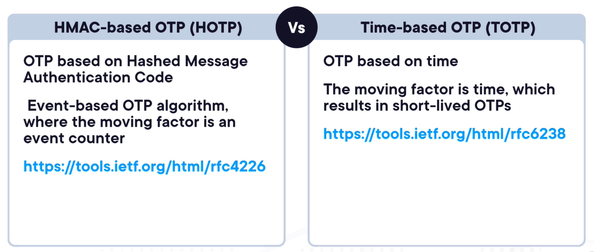

TOTP works in this way:
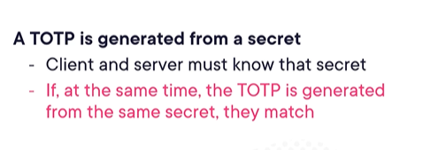
In order to configure this in a safely manner, the secret needs to be sent to the client. This should not happen over the wire. Usually a user is forced to scan a bar code that contains the secret.
See the example of such URI:
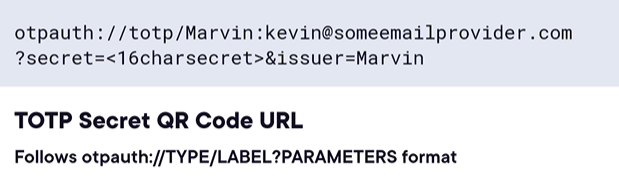
SO then the client safely stores the secret and the IDP does the same. This is the registration flow.
For the authentication flow: a random number is generated for use at a specific interval from the secret. The user inputs the TOTP at the IDP level and the IDP generates a TOTP using the same secret. When there is a match, authentication is successful.

### Add MFA with google authenticator app

The secret needs to be per inidvidual user. So we need to first enhance our schema to do that.

1. So we add a collection of user secrets to our user class.
2. We add a new razor page for mfa registration.
3. At the end we generate a secret link like the one of the picture above.
4. Now we need to add a library to generate a QR code, like qrcodejs. We can just copy and past to our wwwwroot/js folder.
   The javascript library will generate the QR code for use. Check the razor page. It will pick the information from the view.
   Then we navigate to our identity provider to the index page and add a link there to navigate to the MFA page we just added.
   We will see the QR code being generated (we had to add a qrcode helper in order to execute scripting on the page.)
   We will input that secret on our phone and from that moment on, we will have OTPs being generated!.

But how to add that to the login flow?
We need to take into account the types of users. For example, if a user uses Azure Ad, azure AD most likely has MFA. So we would be requesting it multiple times and that is not the best user experience.
But we also want to enforce that somehow because we may have local users. It would be great that the 3rd party provider would tell us how the user authenticated. Not all of them gives us that information. We can enable to certain users, etc, only for local users. All options should be considered.
We are going to required that on our login for local user accounts.

1. So we need to add a Totp property to our input model on our login page.
2. We need to generate the TOPT ourselves from the secret and compare with the one entered by the user. We can import a nugget package like two steps authenticator.
3. We stored the user secret on our database so we can retrive it after successfull credentials verification to see if the passwords match.

```
      var userSecret = await _localUserService.GetUserSecretAsync(user.Subject, "TOTP");
      if (userSecret == null)
      {
          ModelState.AddModelError("usersecret", "No second factor secret has been registered - please contact the helpdesk.");
          await BuildModelAsync(Input.ReturnUrl);
          return Page();
      }

      // validate the inputted totp
      var authenticator = new TwoStepsAuthenticator.TimeAuthenticator();
      if (!authenticator.CheckCode(userSecret.Secret, Input.Totp, user))
      {
          ModelState.AddModelError("totp", "TOTP is invalid.");
          await BuildModelAsync(Input.ReturnUrl);
          return Page();
      }
```

## Asp.net core Identity

Asp.net core identity is an out of the box solution provided by microsoft for user management.
It provides password management capabilites, as well as roles, claims, profile data and SSO. It is an alternative to what we have done so far. SO far, we have implemented a few screens, etc.
Asp.net core identity provides those out of the box, if we do not need much flexibility on our Auth architecture.
Since .net 8 identity endpoints are also provided. They are the same endpoints the Asp.net core identity UI uses behind the box (kind of), which allows the user to keep they user management screens on the front end technologies they are using.
In this chapter we will include it with identity server. Our starting point is our application before we started adding users to our local database.
When we add asp.net core identity we select:

1. Add new scafolded item to our api.
2. We choose all the options we want to override:
   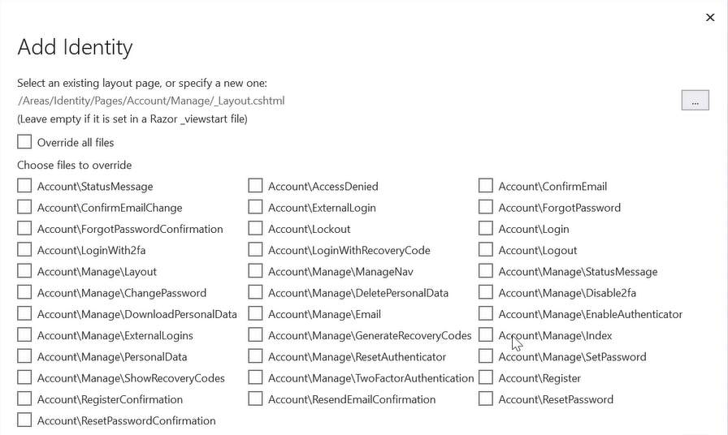
   The files we select will be added to our project so we can costumized it.
   Exploring the added code we can see:

```
        builder.Services.AddIdentity<ApplicationUser, IdentityRole>()
            .AddEntityFrameworkStores<MarvinIDPContext>()
            .AddDefaultTokenProviders(); // this adds identity services
```

The aboce few lines avoids adding the UI pages. What we want to accomplish is to have idenity server as the main control of the flow but have integration points with asp.net core identity.
It is through the user manager that we add users, add claims, etc.
Our seed data file reveals some of the capabilities of the user manager.
In order for all of this to work, we need to import duende asp.net identity nugget package into our solution and tell identity server to use asp.net core identiy.

## Going to production

Identity server is like any other web app. One way of hosting it in Azure is by using Azure App Service. We create an app service instance and copy our files to it (we can do from visual studio, ci cd pipelines - check devops repo, Cli, etc..)
Before deploying it we need to configure operational data and configuration data.
Configuration data includes resources like our APi and identity resources, CORS or identity providers..
Configuration can be hard coded, in settings file or in database store, so they can be changed from a management screen.
Operational datra: grant results (tokens, codes, etc), key management data, server side sessions, etc.
So far we had evertyhing in memory but that is not a good idea. In a multi server environment, different requests may end up in different servers, like when we use a load balancer.
This means we cannot use sql lite as data store as well because it is a file deployed with the same host. So we need a real database. We are going to use an azure sql database.
We also need a central safe location for protecting keys and grants at rest, session management etc.
We also need to store signing credentials in a central location. Signing credentials need to be consistent between all instances of our app under a load balancer. We will store a certificate in azure key vault to accomodate that.
Last thing to keep in mind is that proxy servers, load balancers, etc often obscure information about the request:

1. original scheme when Http gets proxyied to https.
2. original client ip address (our host will receive the request from the load balancer and not from the client)
   So we need to use forwarded headers.

When deployed to production we also need a license (even if it is free). So we are going through that process now.

## Storing configuration data in azure database

1. The first thing we need is to create an SQL server database resource in azure:

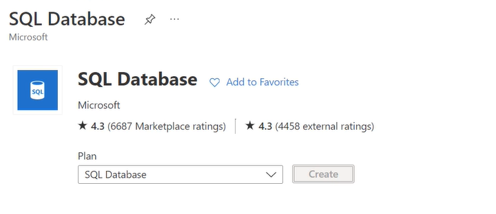

Store the user name and password and Azure gives us the connection strings to connect to our database. We can also connect directly using SQL server management studio.

2. We are going to seed the database in azure with the data we have on our config file. As such, all the tests users and other data in our config file is going to be seeded in the database. In a real production scenario we would need some sort of management screen to include all this data as well.
   In a sw development scenario we would have a database locally and the azure one is just for production.
   So we need to add the migrations for the configuration that are in another asssembly (from the nugget of duende) and comment out all the in memory configurations:

```
var migrationAssembly = typeof(Program).GetTypeInfo().Assembly.GetName().Name;
.AddConfigurationStore(options =>
{
    options.ConfigureDbContext = optionsBuilder =>
        optionsBuilder.UseSqlServer(
            builder.Configuration.GetConnectionString("MarvinIdentityDBConnectionString"),
            sqlOptions => sqlOptions.MigrationsAssembly(migrationAssembly));
})
```

3. Add migration. When adding the migration we need to be specific about the context, given the fact we have multiple contexts.
4. Add SeedData class to seed the configuration data we have in the Config class. (in production it is better to have some sort of admin ui)
5. Update database command to create it and lets go!
   Configuration data is accessed very often during authentication so it is a goog idea to add cache. For now in memory cache may be ok, but on a production environment with scaling, distributed cache is better, so multiple services can access it.

### Persisting operational data

The next step is to persist operational data. We can use the same database we are using for our configuration. We can similarly call:

```
            .AddOperationalStore(options =>
            {
                options.ConfigureDbContext = optionsBuilder =>
                    optionsBuilder.UseSqlServer(
                        builder.Configuration.GetConnectionString("IdentityServerDBConnectionString"),
                        sqlOptions => sqlOptions.MigrationsAssembly(migrationAssembly));
            });
```

then similarly run migration:

```
add-migration -name InitialIdentityServerMigration -context PersistedGrantDbContext
```

This will create the operational tables that sore tokens expiration, statuses etc.

Now we can move as well all the user data to Azure. On real data we store hashed salted versions of the passwrod.
For this we need to create another sql server database in azure and recreate the migrations (they created based on sql lite provider).

### Data protection
