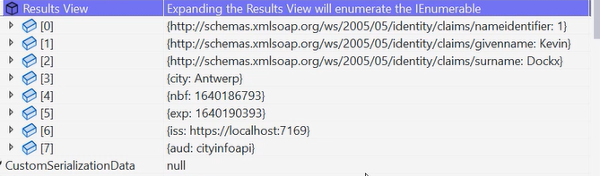

# AspNetCoreWebApi

This web api was started as the template for web APIs in visual studio.
The only nugget package that gets imported out-of-the box is the Swashbuckler,
so we use the open API standard to document the API (swagger).
It is basically a new endpoint with a web ui documenting all the enpoints of an api.

_LaunchSettings.json_ is an important file in the template. It is used to setup the local environment for development.
It is not deployed and it contains profile settings.
An http profile and a https profile that is used by kestrel server to launch the project.
Another profile is IIS server to launch the project using the iis.
The profile dictates the url the profile runs on and the port.

## Solution structure

_AppSettings.json_ contains application settings with some default configuration, like logging. By default, it also create AppSettings.Development.json that allows us to override some default settings just for our development environment.
We have a Controllers folder with a default controller (part of the mvc part).
CityInfo.API.http can be removed. It is used to test the api but we can do that with postman.
Program.cs contains the startup the application, in this case a web application that needs to be hosted.
The builder can be used for that. It is here that dependency injection gets configured as well.
The last section configures the API middlewares.
The way the middleware gets configured dictates how the requests get processed.
The middleware added result in a request pipeline. The order on which these middleware are added matters:

The result of the middleware processing is a response.
Middleware that can be added are, for example, authentication middlewares or diagnostics middlewares.
Each component in the pipeline chooses to pass the request to the next component on the pipeline or not.
On example of that is the authentication middleware. If authentication is not successful, the request does not get processed.
In _Program.cs_ we also observe code that checks on which environment the application is running.
Asp.Net, by default, contains the environments: Development, Staging and Production.
The application host provides a way of accessing the application environment.
The profile dictates the url and port the application runs on.

## MVC

Mode view controller is the most common used pattern to develop web apis.
Unlike with front end applications, we do not have a view within a web api.
The MVC pattern focus heavenly in the spearation of concertes, improves testability and promotes code reuse.
MVC is the pattern used in the presentation layer, not on the other layers of the application.
Parts of MVC:

1. Model: represents application data and/or business logic and rules
1. View: representation of the data.
1. Controller: handles user input and translates that to model data the view can work with.
1. The controller chooses the view and provides it with data.

In an API our view does not exist or it is the representation of data, like json to be sent over the wire.
The MVC architecture:

We introduced our cities controller that inherits from controller base (controller has more stuff not needed in case of a web api)
THe Api controller attribute is not strictly necessary but it improves dev experience while developing APIs (errors and validations).

## Routing

Routing matches a request URI to an action on a controller.
The prefered way to setup this on ASP.net is to use endpoit routing.
Endpoint routing can be configured in the middleware.
We can inject pieces of middleware that know which enpoint to select.
There are two ways of mapping endponits: convention based or attribute based. Attribute base is the preferred way.
By calling MapControllers no conventions are applied and we can just use attributes no map actions:

The Route attribute can be applied at the controller level class, which defines a base route to the controller itself and avoids some repetition on all actions.
If we use [Route("api/[Controller]")] we basically map the url to the controller name. In our case the cities controller will have the url .../api/cities.
Be careful with this approach because renaming the controller would change it to the clients.
Each controller action can have the more specific URL parts and parameters. Parameters are used in atributtes with curly braces: "{cityId}"

## Status Codes

Status codes are a very important piece of public APIs.
Status codes are the only thing the client has in order to know if the request worked out as expected.
200 Code means the request went ok. Sometimes is common for people to send 200 if something went wrong (like the routing was ok but an entity was not found).
500 means internal server error. Do not use this one if the client made a mistake.
There are several levels of status codes:

1. Level 100: international status codes, almost never used. Pure informational
1. Level 200: success status codes.
   1.200: success request
   1.201: resource created
   1.204: no content. Example delete: it was successfull but returned no content.
1. Level 300: redirection status codes.
1. Level 400: client mistakes.
   1. Bad request: 400
   1. 401: Unauthorized. No Authentication
   1. 403: Forbidden. Authentication succeded but authorization did not.
   1. 404: requested resource
   1. 409: conflict. This is meant for scenarios where concurrency issues happen (two parallel requests updating the same resource at the same time).
1. Level 500: server mistakes

Asp.net core has a few helper methods to allow us to return responses with the proper error codoes in case of errors or successfull responses.
Responses are returned as _ActionResults_ or _ActionResults<T>_.
But what to do with child resources?

In our example, we have points of interest that are dependent on the city objects: there is not a point of interest without a city.
Notice the route of the point of interest controller. Because it makes no sense to have a point of interest without a city, the points of interest controller reflects that on its URL.
The base route of the controller itself is already reflecting that by asking for a city id.

We can also add additional information or details to problems we encounter. We can do that by using _Builder.Services.AddProblemDetails()_.
This is suitable for most cases.
In this example we added server name that can be usefull if we are executing in a multi server environment.

## Content negotiation

Content negotiation is the selection of the best representation for a given response when there are multiple representations available.
When we develop a public API, not all clients might be able to deal with a json representation, for example. They might request a xml representation.
It comes in the request headers as the media type: application/json, application/xml, etc:

Asp.net supports that via output formatters.
The support is implemented by ObjectResult. All action results inherit from ObjectResult. Our models get wrapped by these objects that support content negotiation. We just need to worry about configuring the correct formatter.
The default is json formatter.
We can configure and change the default output formatter. When we add controllers, if we specify several output formatters, the default one is the one that was added first.
The services collection has some methods to add the most standard output formatters out of the box to the IoC container.
The same can be said about input formaters.

In the Ioc container, where we the _AddControllers_ method, we can setup the option _ReturnHttpNotAcceptable_ to true. This will return an error code 406 telling the client that the request is not acceptable (if the client in the headers asks form xml and the api does not support it for example).
See file content as well.

## Manipulating resources

Data can be passed to an API by various means. Via query parameters or via request bodies.
We can apply binding source attributes that tell the model binding engine where to find the binding source. They tell ASP.Net core where to find a certain value.
Multiple such attributes exist:

1. [FromBody] : request body
1. [FromForm] : form in the request body.
1. [FromHeader] : request header
1. [FromQuery]: query string parameters
1. [FromRoute]: Route data from the current request.
1. [FromServices]: services injected as action parameters
1. [AsParameters]: method parameters

By default, the asp.net core runtime attempts to use the complex object model binder when there are no attributes, which pull data from value providers in a defined order.
When using the [ApiController] attributte [FromBody] is inferred for complex types.
[FromForm] is inferred for action paramters of type IFormFile and IFormFileCollection.
[FromRoute] inferred for any action parameter name, macthing a parameter in the route template.
[FromQuery] inferred for any action paremeters.

Binding source attributtes can be then applied when there is the need to override default behavior.
In our _Post_, in the points of interest controller, a few key things to take a look at:

We return a _CreatedAtRoutResult_. When we return this type, we send the route at which this object can be fetched by using the http get method.
It basically returns in the reponse header a location: the url of the object we've just created:

Look also in the request header now, the content type. It tells the API how to deserialize the object.

## Validate input

When using the _ApiController_ attribute at controller level, asp.net returns error code 400 if validation fails.
Asp.net returns 400 if the request body is empty automatically.
Other custom validations can be made with data annotations and fluent validation.
Data annotations are attributes and asp.net provides attributes for very common validations, like email, phone, number ranges, required values, etc.
The use of data annotations is ok for simple use cases.
For big applications Fluent validation must be considered: annotations mix rules with models, so it does not follow the principle of a good separation of concerns.

## Updating a resource

There are full updates or partial updates.
Full updates are done with HTTP put and partial updates with HTTP Patch and json documents.
Put means all fields of the objects will be updated, patch means we can send only the change set over the wire.
The patch needs to contain the fields that need to be updated and its values.

To check: json Patch (RFC 6902): describes a document structure for expressing a sequence of operations to apply to a json document.
It will list all the properties that need update and the values.

When doing the patch we need to pass the model state and verify manually if the model state is valid after applying the patch document.
The document might have properties that are not in our model for example.

## Logging and exception handling

Loggers can be injected via dependency injection. Logging providers can be configured to write logs into a file, to azure, etc. By default asp.net loggs to the console. Logging configurations are present in the _appsettings.json_ and can be configured per environment.

Usually the prefered approach is to handle exceptions in a central place.
Asp.net core by default, in the development environment, enables the development exception page.
The developer can see the exception and the stack trace in the browser. CAREFUL: never send the exception to the client, in other environments, it exposes implementation details to the consumers, that can use that information for attacks.

In other environments, besides the development, we can add the exception handling middleware (for that we need to add problem detials too). It makes sense to build a user friendly errors response by using the probem details object seen before. In front-end apps, it makes sense to build a nice user friendly error page.

Plenty of log providers (NLog, erilog, etc). They implement the ILogger interface. Adding loggers to our controllers and services we just need to inject ILogger<T>, being T the component type.

Other custom services can be added via dependency injection as well. There are several lifetimes:

1. Scoped: an instance per request
1. Transient: an new instance every time it is requested
1. Singleton: an instance for the whole application

Dependency injection is a broader topic, that deserves its repository and discussion of its own.

## Configuration

By default, the asp.net creates the file _appSettings.json_. This configuration is available as key value pairs in the application, by injecting the interface IConfiguration where needed. There is also the option patterns that is worthy a check.
In our case we introduced there default email settings.
We can vary our configuration based on the environement we are running the app. By default, asp.net core creates a second app settings file called: appSettings.Development.json, for the development environment. We can add more files to staging and production environments like: appSettings.Staging.json, etc.
The appSettings.json has the default values, that can be ovverriden in the environment specific files. So the environment specific files do not need all the configuration values in them.
In this case we changed the email address to where we send the point of interest deleted.

## Models

Models represent data and behavior. Data is stored in a database in form of tables which is not very object oriented friendly. It is then very common to use ORMa (Object-Relational Mapping) that let us manipulate data from a database using an object-oriented paradigm and fetch the data as entities, or, our models. We can work with object instead of sql statements.
Within the .net realm, EF core is a widely used ORM that supports SQL Server, Postgres, etc.

Our entitties can use data annotation attributes to properties that can tell EF if a property is for example a key. If the property is name "Id" EF core also recognizes it as a key, due to the naming conventions in place.
In our example we use data annotations, but fluent APIs are also possible to achieve the same results. Data annotations configure the database constraints as well: if we do not specify a max lenght of a string property,the database will use varchar max instead of limiting the column size.
The DTOs do not have some of these annotations, because they are not needed to store the data in the database.

This is a web api trainning, so in order to dig deep into EF go here:.
A note on returning objects: APis usually do not return the same entities as they are in its data store.
Usually, Data Transfer Objects (DTOs), are returned. In this demo we introduced the AutoMapper to map entities to DTOS and the repository pattern, to abstract the DBContext and the data access completely. Here are the advantages of the repository pattern:

Some notes on gettings resources: _IActionResult_ is more appropiate when more than one Dto type can be returned. Check the _GetCityById_ with or without points of interests (dtos are different).
A thing to pay attention to is to retrieve child objects. If the parent does not exist, 404 should be returned. Not having the parent is different than an empty list. That is why we have _CityExistsAsync_.

## Security

We've just seen how to configure EF core with SQL Lite. In order to connect to a database, we need a connection string. Connections strings are considered sensitive data.
We may be tempted to store such values as configuration data in the AppSettings. That is ok for development environments, but not ok at all for production environments because connection strings have server names, combinations of user and password, etc.
There are several safe locations: azure key vault (tto far for thos course), environment variable.
Environment variable is a variable is a value that is set outside of the program, but on the operating system (so never on the source control system).
Imagining our windows laptop is the production server we can setup an environment variable there. Go to windows menu -> Edit System Variables -> NewSystemVariable.
Visual studio overrides appSettings with environment variables. So in order to keep developing we need to remove it.

SQL injection is an attack in which malicious code is inserted into strings that are later passed to an instance of a database server for parsing and execution.

Here is an example, where a client sends this string to filter for city name:

That gets translated into two sql statements, as we can see. The script is dropping a table, meaning the app would loose data.
Also, other statements could be executed, like query sensitive user data.
Code that constructs SQL statements should be reviewed for injection vulnerabilities.
The best way to protect agains SQL injection is by encapsulating and parameterizing SQL commands. This way the input text is treated as paremeter and not a SQL command:

EF core gives almost this out of the box. Most of the queries are done as linq statements.

Attention in creating files on the server.

# Searching, filtering and paging

Filtering a collection means limiting the collection taking into account a predicate. It is done by passing the fieald name and value via query string. The filter is applied to the fieald name passed throughÇ

In our cities controller, method get citties now accepts a string parameter called name. We are gona get from the URL. The attribute [FromQuery] is not necessary but some people do it for readbility purposes.
Notice that the parameters are of Nullable types.

Searching a collection means adding matching items to the collection based on a predefined set of rules. It is passed through a value to search for via the query string. It is up to the API to decide how to implement the search functionality:

In our get cities controller we combined searching and filtering. We introduced that functionality at the repository level to avoid fetching big collection from the database. We used an IQueriable internally at the repository level, to build a query and then executing the whole query at once. The query is built as an expression tree. This is an important principle of deferred execution.Query execution occurs sometime after the query is constructed, when it is iterated over (calling ToList, etc)

In real-world scenarios collections grow quite large. Paging helps avoid performance issues. Paging parameters are aslo passed via the query string:

Good practices on pagins are:

1. Limit page size: consumers could still pass a big number for page size and create problems. Page size should vary by collection to allow clients to customize their collections.
1. Page by default: if the page number is not specified, send page 1
1. Page all the way through the underlying data store.

It is good practice to send pagination metadata in the response. It often includes:

1. Total amount of items
1. Total amount of pages
1. Current page number
1. Page size

# Securing APIs

There are several ways of securing APIs, some at infrastructural level or application level.
Some use both combinations. On this course, we will focus on application level.
When an API receives a request it has to know the user/app trying to access the resource. It has been proven that sending directly the username and password over the wire was a bad idea.
Instead of sending user and password, tokens should be sent.
Tokens represent consent.
We send the user name and password the first time, we get a token back and, after that, we just send the token.
A token typically has 3 pieces:

1. Payload: piece of json that contains generic information, like, when the token was created, and some info about the user.
1. Signature: it is a hash of the payload, used to ensure the data wasn't tampered with. If someone changes the payload, after the signature was created, the hash will not match with whatever is on the payload. For signing something, we need a key that is generated from a secret. The server knows the key and how to decrypt the signature using the key. If the information on the payload does not match the signature it means that the information was compromised.
1. The header: essential token information like the key algorithm used for signing.

On our simple case, we are using ASP.NET classes to generate our own token. The authenticate method is recommended to be a post method.
In our case, given that is a development machine, we stored the secret key in the appSettings.Development.json. In production they need to come from key vault.

To require authentication on our API we did several things:

1. On the controller, we declared the [Authorize] attribute.
1. In program.cs we need to configure the service collection to require authentication and specify the conditions on which the token is valid:
   
   In this picture, we can see that the token is valid if the audience is the same as the one in our configuration etc.
1. In the middleware we need to call the app.UseAuthentication.

One thing to keep in mind is that the order the middlewares are added matters, so we need call the AddAuthentication before the AddAuthorization etc.
If the user is not authenticated, our API needs to be protected.

The ControllerBase class exposes a property called User, of type _ClaimsPrincipal_. We can use this object to inspect the claims of the user:

The claims contain user information like City, etc.
With the claims information we can build an authorization layer and check block access to information. For example, we can forbid a user from one city to see the points of interest of another city, etc..
This authorization layer is based on the definition of policies. Policies allow us to define complex authorization rules, by combining a set of claims together. This authorization strategy goes by
ABAC/CBAC/PBAC:
Attribute based access control; Claims..; Policy based...
This is the preferred approach this day over Role-base access control because they allow for the setup of complex rules like: users that live in cities with greater than 500k people, are allowed to do something..

We learnt how to create a policy but, we have a more advanced course on auth here.
The policy needs a name and a set of requirements:

When all requirements are set to true, then the user is authorized.
Then, we need to add the policies to our controller actions or to the whole controller so it applies for all actions.

More often that not, we won't need to write our own token generation service. At big companies and enterprises, auth is handled at a central location and usually by a proven identity provider like Okta, identityServer, etc..
This can be challenging during development to integrate with identity providers. For that, microsoft create user-jwts
If we run the create command on project directory the donet cli scans through the launchSettings.json file and generate audience information, etc..
We can specify those parameters to the command:
_dotnet user-jwts create --issuer https://localhost:7169 --audience cityinfoapi_

this command creates a token for the specified issuer and audience. We also need to check which key the donet user-jwts is using by running:

_dotnet user-jwts key --issuer https://localhost:7169_

The key is related to the issuer. The cli will give us the key that we can copy to the appSettings.Dev and continue to test the API.

Further command combinations are possible: we can specify claims for the token as well, so that we can test authorization polocies:
dotnet user-jwts create --issuer https://localhost:7169 --audience cityinfoapi --claim "city=Antwerp"

Here we added the claim city=Antwerp that matches our authorization policy.
We can access the list of tokens of the project. Check the CLI of donet user-jwts..

This demo presented the basic security apps and token generations that is ok for basic apps.
There are standars that improve on this:

1. OAuth2: is an open protocol to allow secure authorization in a simple and standard method from web, mobile and desktop applications to secure access to APIs. It allows the client apps to access APIs on behalf of the user or on the app itself. The tokens are named access tokens
1. OpenId connect is added on the top of that. It is an identity layer on top of OAuth2. You can get a new token called identity token that can be used to login in applications. See for more details.

# Versioning and documentation

As APIs evolve, different versions start to co-exist. There is serveral ways of versioning an API:

1. Versioning the URI
1. Versioning the URI via query string parameters.

A popular way of versioning is to use Asp.Versioning.Mvs package to use URI versioning (one of most popular).
The ApiVersion attribute can be used at the controller level.
If the url does not specify the api version, asp.net core will chose the version 1 as default version.
We tested in this demo, a controller that had version 2, and we did not send any version in the URL: the server anser back with error 400 and with the message "Unsupported API version".
The version can be requested by using the key-value pairs query string parameters:

The api version attribute can be applied multiple times.
The api version attribute, like the authorization claims, can also be applied to the controller actions individually, to allow finer control.
It is a good practice to deprecate mehotds before deleting them, so the clients are not faced with breaking changes with being notified first.
It is a considered a good practice to version the deprecated actions. See the response headers with the supported versions and deprecated versions:

There is nowadays a more popluar way of doing api versioning, with so called versioned routes.Versioned routes basically means that the route itself contains the version. Example: api/cities/V1

Documenting an APi is crucial both for public or to inside inside an organization. This optimizes time and workflows because people know how to integrate with our API immediatly and lead to adoption immediatly. If people do not know how the API works, they can decide to develop their own.
OpenAPI is a stander for documenting APIs using json or yaml. Basically two components are needed to document an API:

1. A tool to generated the APi specification by inspecting our API
1. Another tool that generates documentation UI from that specification.

Some notes:

Swashbuckle generates and open APi specification from our webApi. It wrapps swagger-ui.
We can see in program.cs some lines that add Swager to our API. they come as the default asp.net core template of a web api.
The default generated documentation at this point in the module is not necessarly the best. look at how the version urls were generated:

some notes for return types. using IActionResult<T> is good for documentation purposes because the schemas are auto generated. Swashbucle looks at our model types (nullable vs not) and data annotations to generate the schemas.

# Testing

This section talks about api testing, at an endpoint level, not unit tests.
It is possible to test the api endpoints with:

1. Swagger UI (manually and limiting)
1. Using tools like Postman or similar.
1. HTTP REPL (needs to be installed)
1. Using .http files from visual studio.

HTTP REPL allows us to test the API endpoints from the command line. It connects to the api and navigates through its routes like we navigate through directories, with a CD command.
Here is an explample how to to test a GET method. First, we authenticate:

We authenticated by calling post on the route of the aunthentication controller.
After obtaining the toke, we included in all headers.
Then we navigate to the cities controller and get all cities:

We can configure repl to work with notepad and everytime we send a post, we can paste in the notepad the request body.

Another way of testing is to use .http files. This feature is recent and under development. Available with .net8.
We can use the window from vs called _Endpoints Explorer_ and we can generate the requests directly on the .http file. We can also debug the API using this file.
We can test everything without even leaving visual studio.

# Deploying

Publishing an api means creating the set of files required to run the application.
So everytime we build it, we are publishing it.
So after this files are created, they need to be moved over to a host.
Host is the environment these files are copied to, the hosting server.
Deploying meaning copying the files to a host.
Locally it is the bin folder. Once files are in the bing, the process manager starts the application. Our process manager is Kestrel webserver, as default in dev environment.
There are several factors we need to consider when deciding how to host our application:

1. Scalability
1. Ease of maintenance
1. Cost
1. Application-specific requirements
1. Organizational preferences
1. Level of control over the host environment.
   There lots of options, azure, aws, files in one location, docker, kubernets, automatically scalling..

Run on azure app service is a popular option (no concerns over infrastructure).
When using azure app services, with proxies and load balancers, these components often obscure information about the request, changing its headers:

We can configure the API with the forward headers middleware to ensure the requests are properly handled by readeing the request headers. That information comes in the header as we can see in the pciture The forwrd headers middleware should be place before almost anything in the pipeline.

In this demo we created an azure subscription.
We selected deploy to windows azure. We added to the default resource group.
Resource groups are logical containers for organizaging and managing azure resources. Resources in a resource group share a common lifecycle, so we can deploy update and delete them together as a group.
It is a way in azure to group stuff together to simplify common tasks like resource management, monitoring and access control in Azure.
In real life, we would want to create a resource group to our application and link all the resources that our application needs under the same resource group.
Hosting plan come in different tiers, check pricing.
Azure virtual machine -> we need to manage infrastructure (to be avoided if possible).

We can add other app services to deploy together with the one created. A deployment can consist of multiple steps and app services, a key vault, a database server, Next we can configure API management (Appium). It will add a layer in front of our API, a gateway. We can choose how to expose, secure, routing, response transformation, token validation and analytics.
Check outher repos for this.

The url the app runs on depends on the publishing profile name.
We used application insights for diagnostics and logging.
Altough application insights is much more than that.
How do we log for application insights? By configuring another serilog sink in program.cs.
We need to enable application insights on azure portal. Azure will generate a key that will correlate our logging sink to our resource group in devops. Serilog needs that key to send the logs. Check program.cs

The appSettings.production needed to be updated in order to run the app in azure. We need a connection string and we need to fetch the secrets from azure key vault. Azure key vault is a service that we can use to sote and manage cryptographic keys, secretes and certificates used by cloud applications or services.
